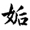
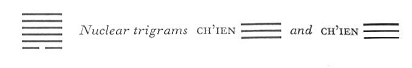

# Commentary: 44. Kou / Coming to Meet

The hexagram of COMING TO MEET takes its meaning from the one dark line that develops at the bottom; therefore this first line is the constituting ruler of the hexagram. But the five yang lines have the duty of restraining the yin power. Among the five, the second and the fifth have a strong and central character. The one stands near to the yin power in order to restrain it, the other holds the place of honor and comes down from above to restrain it. Therefore the nine in the fifth place and the nine in the second are the governing rulers of the hexagram.

The Sequence

Through resoluteness one is certain to encounter something. Hence there follows the hexagram of COMING TO MEET. Coming to meet means encountering.

Miscellaneous Notes

COMING TO MEET means encountering.
Coming to meet means encountering. The lower trigram is Sun, wind, which drives along beneath Ch’ien, heaven, the upper trigram, and hence encounters all things. Furthermore, a yin line develops below, so that the dark principle thus unexpectedly encounters the light. The movement is initiated by the dark principle, the feminine, which advances to meetthe light principle, the masculine. This hexagram is the inverse of the preceding one.

### THE JUDGMENT

> COMING TO MEET. The maiden is powerful.
>
> One should not marry such a maiden.

Commentary on the Decision

COMING TO MEET means encountering. The weak advances to meet the firm.

“One should not marry such a maiden.” This means that one cannot live with her permanently.

When heaven and earth meet, all creatures settle into firm lines.

When the firm finds the middle and the right, everything under heaven prospers splendidly.

Great indeed is the meaning of the time of COMING TO MEET.

Sun is the eldest daughter. A yin line develops within and rules the hexagram, while the yang lines stand aside as guests. In this way the yin element becomes increasingly powerful. This is the line of the trigram K’un of which it is said: “When there is hoarfrost underfoot, solid ice is not far off.” Hence the gradual expansion must be checked in time, for the way of inferior people increases only because superior men entrust them with power. If this is avoided when the inferior element first appears, the danger can be averted.

When the strong element appears for the first time in the midst of yin lines, the hexagram is called RETURN. The superior man always stays where he belongs. He comes only into his own domain. When the weak element first appears in the midst of yang lines, the hexagram is called COMING TO MEET (or ENCOUNTERING). The inferior man always has to depend on a lucky chance.

Marriage is an institution that is meant to endure. But if a girl associates with five men, her nature is not pure and one cannot live with her permanently. Therefore one should not marry her.

However, things that must be avoided in human society have meaning in the processes of nature. Here the meeting of earthly and heavenly forces is of great significance, because at the moment when the earthly force enters and the heavenly force is at its height—in the fifth month—all things unfold to the high point of their material manifestation, and the dark force cannot injure the light force. The two rulers of the hexagram, the nine in the fifth place and the nine in the second, likewise symbolize such a fortunate meeting. Here a strong and central assistant meets a strong, central, and correct ruler. A great flowering results, and the inferior element below can do no harm. Thus it is an important time, the time of the meeting of the light with the dark.

### THE IMAGE

> Under heaven, wind:
>
> The image of COMING TO MEET.
>
> Thus does the prince act when disseminating his commands
>
> And proclaiming them to the four quarters of heaven.

The prince is symbolized by the upper trigram Ch’ien, heaven. His commands are symbolized by the lower trigram Sun, wind, whose attribute is penetration. The spreading to the four quarters of heaven is symbolized by the wind driving along under heaven.

### THE LINES

Six at the beginning:

*a*) It must be checked with a brake of bronze.

Perseverance brings good fortune.

If one lets it take its course, one experiences misfortune.

Even a lean pig has it in him to rage around.

*b*) To check with a brake of bronze. This means that it is the way of the weak to be led.
The brake is below. K’un, in which this is the first line, means a wagon; Ch’ien is metal, by means of which the wagon is to be braked underneath. This braking brings good fortune, because it accords with the truth that a weak thing unable to guide itself must be led. If we give it free rein, misfortune befalls us. This shows the trend of the whole hexagram. The line is compared to a pig that is as yet weak and lean but that will later tear about: this likewise refers to the yin nature of the line. The pig belongs to water, in particular to the yin aspect of water. It is worth noting that this line comes into account only as an object acted upon.

Nine in the second place:

*a*) There is a fish in the tank. No blame.

Does not further guests.

*b*) “There is a fish in the tank.” It is a duty not to let it reach the guests.
The fish likewise belongs to the yin principle. The reference is to the six at the beginning. This six is in the relationship of correspondence to the nine in the fourth place, the “guest.” But through this relationship the yin element would penetrate too far into the hexagram. Therefore the six at the beginning is held captive, like a fish in a tank, by the nine in the second place, the loyal official, who has a relationship of holding together with it. As a result all goes well. It is to be noted that the word here rendered by “tank” includes the idea that the yin element is treated in a perfectly friendly way.

Nine in the third place:

*a*) There is no skin on his thighs,

And walking comes hard.

If one is mindful of the danger,

No great mistake is made.

*b*) “Walking comes hard.” He still walks without being led.
Since this hexagram is structurally the inverse of the preceding one, the present line corresponds with the nine in the fourthplace in Kuai. Hence the similarity in text. But the inner attitudes are different: in the former there is a resolute intention to press upward in order to throw out the dark line above, here a desire to meet the dark line below. But this dark line has already been taken into custody by the nine in the second place, so that a meeting—which indeed would be disastrous—is not possible. The proximity of the line to the upper trigram Ch’ien makes it possible to recognize the danger, but desire remains unsatisfied. Hence the unsatisfactoriness of the situation, although serious mistakes are avoided.

Nine in the fourth place:

*a*) No fish in the tank.

This leads to misfortune.

*b*) The misfortune inhering in the fact that there is no fish in the tank comes from his having kept aloof from the people.
The fourth place is that of the minister. The six at the beginning stands here for the inferior, lowly people. There is a relationship of correspondence between the two lines. Furthermore, it would be the duty of the official to keep in touch with the people. But this has been neglected. The line belongs to the trigram Ch’ien, hence strives upward, away from the people below. By doing this it attracts misfortune to itself. The corresponding nine in the third place of the preceding hexagram is also isolated, but there the inner attitude is correct, here it is not.

Nine in the fifth place:

*a*) A melon covered with willow leaves.

Hidden lines.

Then it drops down to one from heaven.

*b*) The nine in the fifth place hides its lines, for it is in the middle and correct.

“Then it drops down to one from heaven,” because the will does not give up what has been ordained.
This line is the ruler of the hexagram, standing as a prince in its correct and honored place in the middle, and referred to by the words of the Commentary on the Decision: “When the firm finds the middle and the right.” Ch’ien is round, hence symbolizes a round fruit. Here the fruit is a melon; it represents the yin line at the beginning and so belongs to the dark principle. It is protected and covered with willow leaves. No forcible interference takes place. The regulative lines of the laws upon which the beauty of life depends are covered over. We entrust the fruit in our care entirely to its own natural development. Then it ripens of its own accord. It falls to our lot. This is not contrived but is decreed by our accepted fate.

Nine at the top:

*a*) He comes to meet with his horns.

Humiliation. No blame.

*b*) “He comes to meet with his horns.” At the top it comes to an end, hence humiliation.
Ch’ien is the head, here the highest place, which is moreover hard, hence the image of horns. The orientation of the line is quite different from that of the first line, which it should go to meet. It meets the first line with harshness, hence an understanding is extremely difficult. This leads to humiliation. But one does not try to force a meeting, hence one withdraws without blame.
