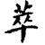
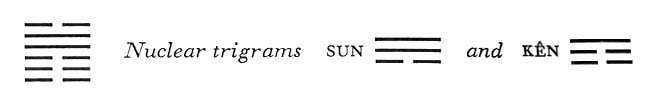

# Commentary: 45. Ts'ui / Gathering Together [Massing]

[45. Ts’ui / Gathering Together Massing](#pup-iching003.html_pup-iching003htmlpt05toc)

The rulers of the hexagram are the nine in the fifth place and, secondarily, the nine in the fourth. Only these two yang lines are in high places. They gather all the yin lines around them.

The Sequence

When creatures meet one another, they mass together. Hence there follows the hexagram of GATHERING TOGETHER. Gathering together means massing.

Miscellaneous Notes

GATHERING TOGETHER means massing.
In the two light lines, of which one is in the place of the prince or father, and the other in the place of the minister or son, the hexagram has a strong focus for gathering together the other lines, all of which belong to the dark principle. While the two primary trigrams, K’un and Tui (crowd and joyousness), indicate the basis of the gathering together, the two nuclear trigrams have the meaning of standing still (Kên) and exerting influence (Sun), which likewise indicates gathering together.

### THE JUDGMENT

> GATHERING TOGETHER. Success.
>
> The king approaches his temple.
>
> It furthers one to see the great man.
>
> This brings success. Perseverance furthers.
>
> To bring great offerings creates good fortune.
>
> It furthers one to undertake something.

Commentary on the Decision

GATHERING TOGETHER means massing. Devoted and at the same time joyous.

The strong stands in the middle and finds correspondence. Therefore the others mass around it.

“The king approaches his temple.” This brings about reverence and success.

“It furthers one to see the great man. This brings success.” The massing takes place on a correct basis.

“To bring great offerings creates good fortune. It furthers one to undertake something,” for that is devotion to the command of heaven.

By observing what they gather together, one can behold the relationships of heaven and earth and of all creatures.

The strong line in the fifth place represents the king, the great man, whom it is favorable to see. Below him is the nuclear trigram Kên, meaning mountain and house. By his side there stands moreover the strong line in the fourth place, that of the minister. The mountain indicates perseverance. Mountain and temple are both places where great offerings are brought. Wind, the upper nuclear trigram Sun, means the influence of what is above, as a result of which works begun will meet with success.

The name of the hexagram is explained in the Commentary on the Decision in a number of ways: (1) the attributes of the two trigrams are devotion and joyousness, on the basis of which gathering together takes place; (2) a gathering needs a head, a center of crystallization, and this is provided in the nine in the fifth place, around which the other lines gather. In order to gather the people together, the ruler above needsjoyousness (Tui); the people below show themselves devoted (K’un).

There is in addition a reference to religion as the basis of gathering together in a community. Heaven is the bond of union in nature, as the ancestors are the bond of union among men. If one knows these forces, all relationships become clear.

### THE IMAGE

> Over the earth, the lake:
>
> The image of GATHERING TOGETHER.
>
> Thus the superior man renews his weapons
>
> In order to meet the unforeseen.

The juxtaposition of the two trigrams provides the image of GATHERING TOGETHER. In that the lake is over the earth and therefore threatens to overflow, the danger connected with gathering together is also indicated. The primary trigrams and the nuclear trigrams, taken individually, show how these dangers are to be met. Tui means metal, hence weapons. K’un means renewal (earth produces metal). The nuclear trigram Sun means the penetrating, the unforeseen. The nuclear trigram Kên means keeping still, obstruction.

### THE LINES

Six at the beginning:

*a*) If you are sincere, but not to the end,

There will sometimes be confusion, sometimes gathering together.

If you call out,

Then after one grasp of the hand you can laugh again.

Regret not. Going is without blame.

*b*) “Sometimes confusion, sometimes gathering together.” The will is in confusion.
The weak line at the beginning is not yet stabilized. To be sure, there is a relationship of correspondence with the nine in the fourth place—indicating sincerity—but since the line isassociated with the two other weak lines of K’un, it allows itself to be influenced by these, so that its natural relations with the nine in the fourth place are disturbed. This brings confusion. But a call (Tui is mouth, hence call) suffices to do away with the misunderstanding, and laughter comes again (Tui is joyousness). It is important, however, to hold to the upward direction.

Six in the second place:

*a*) Letting oneself be drawn

Brings good fortune and remains blameless.

If one is sincere,

It furthers one to bring even a small offering.

*b*) “Letting oneself be drawn brings good fortune and remains blameless.” The middle is still unchanged.
Here there is a strong inner relationship of correspondence with the nine in the fifth place, the ruler of the hexagram. Therefore this line is naturally attracted by the strong line. Since it is central, it does not permit itself to be wrongly influenced by its environment. Hence this inner influence takes effect.

Six in the third place:

*a*) Gathering together amid sighs.

Nothing that would further.

Going is without blame.

Slight humiliation.

*b*) “Going is without blame.” The Gentle is above.
This line has no relationship of correspondence, hence the sighs, the forlornness and helplessness. Since the line belongs to the lower trigram, the relationship of holding together with the nine in the fourth place does not become effective, for the latter line belongs to the upper trigram. However, a connection is established through the upper nuclear trigram Sun, the Gentle, for the six in the third place forms the lowest line in this nuclear trigram, of which the nine in the fourth place is the center. Thereby going, as well as a connection, becomespossible without blame, even though some humiliation remains.

Nine in the fourth place:

*a*) Great good fortune. No blame,.

*b*) “Great good fortune. No blame,” for the place demands nothing.<a id="ref-1" href="#/com-45-ts-ui-gathering-together-massing?id=fn-1">1</a>
This line occupies the place of the minister, who brings about the gathering together on behalf of his prince, the nine in the fifth place. But he does not claim the merit of it for himself; hence great good fortune.

Nine in the fifth place:

*a*) If in gathering together one has position,

This brings no blame.

If there are some who are not yet sincerely in the work,

Sublime and enduring perseverance is needed.

Then remorse disappears.

*b*) If in gathering together one has only position, the will does not yet shine forth sufficiently.
Essentially the requisite position for effecting the gathering together is at hand. But there are difficulties. The nuclear trigram Kên, Keeping Still, works in such a way that the effects on the lower lines do not immediately make themselves felt. Therefore an enduring influence is needed. To the influence of the position must be added the influence of personality. This line according to its character belongs to Ch’ien, hence it is sublime. This character must need acquire enduring form; hence remorse disappears.

Six at the top:

*a*) Lamenting and sighing, floods of tears.

No blame.

*b*) “Lamenting and sighing, floods of tears.” He is not tranquil at the top.
The top line has no relationship of correspondence (cf. the six in the third place), hence the lamenting and the tears. However, there is no blame; for though the line is not tranquil in its exalted yet solitary position, it conforms to the relationship of holding together and turns downward toward the ruler of the hexagram, the nine in the fifth place. The gathering together is achieved because the idea that it is favorable to see the great man accords with the meaning of the hexagram as a whole.

---

**Notes:**

<a id="fn-1" href="#/com-45-ts-ui-gathering-together-massing?id=ref-1">**1.**</a> The Chinese text reads literally, “The place is not correct.” Wilhelm’s translation follows suggestions of the Chinese commentators.
