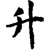
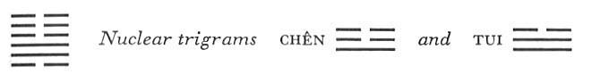

# Commentary: 46. Shêng / Pushing Upward

The ruler of the hexagram is the six in the fifth place. The Commentary on the Decision refers to it as follows: “The yielding pushes upward with the time.” The six in the fifth place is the most honored line among those pushing up. However, the pushing up certainly begins at the bottom. The hexagram pictures wood growing within the earth. But the six at the beginning is the ruler of the trigram Sun and the root of wood; therefore it is at least a constituting ruler of the hexagram.

The Sequence

Massing toward the top is called pushing upward. Hence there follows the hexagram of PUSHING UPWARD.

Miscellaneous Notes

That which pushes upward does not come back.
On the face of it this hexagram is very favorably organized. The movement of the upper trigram K’un is downward, hence the lower trigram. Sun (penetration, wood) strives unhindered toward the top. However, the pushing upward is neither as easy nor as extensive as the rising of the sun in the hexagram of PROGRESS (35). The upward movement is furthermore reinforced by the nuclear trigrams, Chên and Tui, both of which tend upward. This hexagram is the inverse of the preceding one.

### THE JUDGMENT

> PUSHING UPWARD has supreme success.
>
> One must see the great man.
>
> Fear not.
>
> Departure toward the south
>
> Brings good fortune.

Commentary on the Decision

The yielding pushes upward with the time. Gentle and devoted.

The firm is in the middle and finds correspondence, hence it attains great success.

“One must see the great man. Fear not,” for it brings blessing.

“Departure toward the south brings good fortune.” What is willed is done.

The yielding element that, borne by the time, pushes upward, is the yielding line at the beginning; it stands for the root of wood, the lower trigram. The lower trigram is gentle, the upper devoted. These are preconditions of the time that make it possible for the strong line in the second place—which finds correspondence in the weak line in the place of the ruler—to achieve great success. It is said, “One must see the great man,” and not, “It furthers one to see the great man,” as is usually the case. For the ruler of the hexagram is not the great man;it is, on the contrary, a yielding line. The reason for success is not an earthly but a transcendental one. Therefore it is said further, “Fear not,” and, “It brings blessing.” The favorableness of the conditions comes from the invisible world; we must make the most of them, however, through work. Departure toward the south means work. The south is the region of the heavens between Sun and K’un, the two components of the hexagram.

### THE IMAGE

> Within the earth, wood grows:
>
> The image of PUSHING UPWARD.
>
> Thus the superior man of devoted character
>
> Heaps up small things
>
> In order to achieve something high and great.

The heaping up of small things—steady, imperceptible progress—is suggested by the gradual and invisible growth of wood in the earth. “Devoted character” corresponds with the trigram K’un; “something high and great” corresponds with Sun, whose image is a tree.

### THE LINES

Six at the beginning:

*a*) Pushing upward that meets with confidence

Brings great good fortune.

*b*) “Pushing upward that meets with confidence brings great good fortune”: those above agree in purpose.
The yielding line at the beginning agrees in nature with the yielding lines of the upper trigram K’un. Therefore it meets with confidence and has success in its pushing upward, just as the hidden root connects the tree with the earth, and through this connection makes growth possible.

Nine in the second place:

*a*) If one is sincere,

It furthers one to bring even a small offering.<a id="ref-1" href="#/com-46-sh-ng-pushing-upward?id=fn-1">1</a>

No blame.

*b*) The sincerity of the nine in the second place brings joy.

This line is the lowest in the nuclear trigram Tui, meaning joy. The oracle is the same as that pertaining to the second line in the preceding hexagram. In the latter a weak line is intimately connected with the king in the fifth place; here a strong line has an equally intimate relation with the weak line in the fifth place. In each case the spiritual affinity is so close that gifts may be small in extrinsic value without disturbing mutual confidence.

Nine in the third place:

*a*) One pushes upward into an empty city.

*b*) “One pushes upward into an empty city”: there is no reason to hesitate.
This is a strong line in a strong place; it is moreover at the beginning of the upper nuclear trigram Chên, movement. Furthermore, before it are the divided lines of the trigram K’un, as though empty and open, so that they offer no obstruction to progress. This easy progress might cause hesitation, but as it accords with the time, the main thing is to press forward and take advantage of the time.

Six in the fourth place:

*a*) The king offers him Mount Ch’i.

Good fortune. No blame.

*b*) “The king offers him Mount Ch’i.” This is the way of the devoted.
This is a weak line in a weak place. It stands at the top of the trigram Tui, which means the west, and so may suggest Mount Ch’i. The king is the six in the fifth place; the present line represents the minister. The king is like-minded, and therefore makes it possible for him to work effectively.

Six in the fifth place:

*a*) Perseverance brings good fortune.

One pushes upward by steps.

*b*) “Perseverance brings good fortune. One pushes upward by steps.” One achieves one’s will completely.
From the first line to this, the pushing upward proceeds step by step. The first line meets with confidence, the second needs small sacrifices only, the third pushes up into a deserted city, and the fourth finally gains admittance even to realms beyond: these are steps of a progress all summed up in the ruler of the hexagram. At this point, with such brilliant success achieved, it is of the greatest importance to remain persevering.

Six at the top:

*a*) Pushing upward in darkness.

It furthers one

To be unremittingly persevering.

*b*) “Pushing upward in darkness.” At the top is decrease and not wealth.
This line is at the top of the trigram K’un and cannot advance farther. Culmination of the shadowy indicates darkness. When one can no longer distinguish things, one must hold fast that perseverance which lies below consciousness, in order not to lose one’s way.

---

**Notes:**

<a id="fn-1" href="#/com-46-sh-ng-pushing-upward?id=ref-1">**1.**</a> See here, where this line includes the augury, “No blame.”
