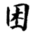
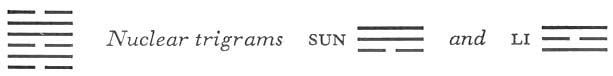

# Commentary: 47. K'un / Oppression (Exhaustion)

The rulers of the hexagram are the nine in the second place and the nine in the fifth. The idea of the hexagram is based on the penning in of the firm element. The second and thefifth line are by nature firm and central, and each is inclosed between dark lines. Hence both these lines are constituting as well as governing rulers of the hexagram.

The Sequence

If one pushes upward without stopping, he is sure to meet with oppression. Hence there follows the hexagram of OPPRESSION.

Miscellaneous Notes

OPPRESSION means an encounter.
Oppression is something that happens by chance. The fact that there is no water in the lake is due to certain exceptional conditions.

Appended Judgments

OPPRESSION is the test of character. OPPRESSION leads to perplexity and thereby to success. Through OPPRESSION one learns to lessen one’s rancor.

The hexagram is full of danger in its structure—a lake, with an abyss opening under it, through which the water flows off downward. Wind and fire, as the nuclear trigrams, are likewise at work, oppressing the water from within. The forces trend in opposite directions. K’an, the lower trigram, sinks downward, while Tui, the upper, evaporates upward. As regards the lines, the yang element is oppressed by the yin element. The two upper strong lines are hemmed in by two weak ones, and so likewise is the middle line of the lower trigram.

### THE JUDGMENT

> OPPPRESSION. Success. Perseverance.
>
> The great man brings about good fortune.
>
> No blame.
>
> When one has something to say,
>
> It is not believed.

Commentary on the Decision

OPPRESSION. The firm is hemmed in. Danger and joyousness. The superior man alone is capable of being oppressed without losing the power to succeed.

“Perseverance. The great man brings about good fortune,” because he is firm and central.

“When one has something to say, it is not believed.” He who considers the mouth important falls into perplexity.

The name of the hexagram is explained in its structure, because in various ways the firm lines are hemmed in between dark ones. Success is achieved in the time of OPPRESSION by maintaining cheerfulness (upper trigram Tui) in face of danger (lower trigram K’an). The firm and central lines that in each case indicate the great man are the rulers of the hexagram in the second and the fifth place. The trigram Tui also suggests speech. But one gets no hearing; the trigram K’an means earache, hence disinclination to listen.

### THE IMAGE

> There is no water in the lake:
>
> The image of EXHAUSTION.
>
> Thus the superior man stakes his life
>
> On following his will.

The Image derives from the relative positions of the two primary trigrams: water is under the lake, therefore drained off. The trigrams individually yield advice for conduct in the time of EXHAUSTION: K’an, abyss, danger, indicates staking one’s life; Tui, joyousness, indicates following one’s own will.

### THE LINES

Six at the beginning:

*a*) One sits oppressed under a bare tree

And strays into a gloomy valley.

For three years one sees nothing.

*b*) “One strays into a gloomy valley.” One is gloomy and not clear.
The trigram K’an stands in the north, where gloom prevails. The nuclear trigram is Li, clarity. The line stands outside of clarity. In other cases the first line images the foot, the toes. But in times of oppression a man sits; therefore the first line here represents the buttocks. The gloomy valley is the first line in the trigram K’an, the pit in the abyss.

Nine in the second place:

*a*) One is oppressed while at meat and drink.

The man with the scarlet knee bands is just coming.

It furthers one to offer sacrifice.

To set forth brings misfortune.

No blame.

*b*) “Oppressed while at meat and drink.” The middle brings blessing.
K’an is wine, Tui food. The man with the scarlet knee bands is the nine in the fifth place, the ruler (the nuclear trigram Sun, in which the nine in the fifth place is the top line, means leg). Between the two rulers of the hexagram—the prince, the nine in the fifth place, and the official, the nine in the second place—the significant relationship is that of congruity rather than that of correspondence. Accordingly, it is a matter not of natural but of supranatural relationships, and therefore the religious act of sacrifice is mentioned. Since it accords with the time, going to the prince who is kindred in spirit is in itself not a mistake, but it cannot be done, because the six in the third place obstructs the way and makes it dangerous.

Six in the third place:

*a*) A man permits himself to be oppressed by stone,

And leans on thorns and thistles.

He enters his house and does not see his wife.

Misfortune.

*b*) “He leans on thorns and thistles”: he rests on a hard line.

“He enters his house and does not see his wife”: this bodes misfortune.
The oppression that afflicts this line is due to the hard line below it and to the hard line above, which is like a stone over it. Thus it can neither progress nor retreat. It represents a man holding the wrong office and hence in an untenable position. The appended judgments therefore allude directly to imminent death; this is what the text under *b* refers to in the words “bodes misfortune.”

Nine in the fourth place:

*a*) He comes very quietly, oppressed in a golden carriage.

Humiliation, but the end is reached.

*b*) “He comes very quietly”: his will is directed downward. Though the place is not appropriate, he nevertheless has companions.
K’an is a carriage, Tui metal. This line is in the minister’s place and therefore has the task of relieving the oppression. The minister allows himself to be influenced by the honor of having received a golden carriage at the hands of the prince, so that he does not fulfill his task as quickly as he should. This is humiliating; yet in the end all goes well. The line is not in its proper place {the place is yielding, the line firm), but it is in the relationship of correspondence to the six at the beginning, toward which its will is directed, and therefore it has a companion that induces it to act.

Nine in the fifth place:

*a*) His nose and feet are cut off.

Oppression at the hands of the man with the purple knee bands.

Joy comes softly.

It furthers one to make offerings and libations.

*b*) Cutting off of the nose and feet means that he does not yet attain his will.

“Joy comes softly,” because the line is straight and central.

“It furthers one to make offerings and libations.” Thus one attains good fortune.
The line is hemmed in by dark lines. Above it is a dark line. When it tries to do away with this line, the effect is as though its nose were being cut off. When it tries to turn downward, it finds there another obstructing line, the six in the third place; when it tries to remove this line, the effect is as though its feet were being cut off. Therefore it cannot carry out its purpose. Nor is the official, with whom it has “a relationship of congruity, in a position to come to its help, because the latter also is penned in and oppressed by dark lines. However, the strong nature of both guarantees final success. Here too, as in the case of the nine in the second place, sacrifice is mentioned.

Six at the top:

*a*) He is oppressed by creeping vines.

He moves uncertainly and says, “Movement brings remorse.”

If one feels remorse over this and makes a start,

Good fortune comes.

*b*) “He is oppressed by creeping vines.” That is, he is not yet suitable.

“Movement brings remorse.” If there is remorse, this is an auspicious change.
A weak line at the peak of oppression—this is not yet the suitable way. But through movement and the awakening within of the requisite insight, one frees oneself from oppression. Hence the prospect of good fortune when the time of OPPRESSION comes to an end.
