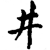
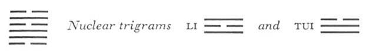
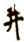
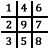

# Commentary: 48. Ching / The Well

The ruler of the hexagram is the nine in the fifth place: The influence of the well depends on water, and the nine in the fifth place is the ruler of the trigram K’AN, water. The meaning of the hexagram is nourishment of the people, and the nine in the fifth place is the prince who provides them with nourishment.

The Sequence

He who is oppressed above is sure to turn downward. Hence there follows the hexagram of THE WELL.

Miscellaneous Notes

THE WELL means union.

Appended Judgments

THE WELL shows the field of character. THE WELL abides in its place, yet has influence on other things. THE WELL brings about discrimination as to what is right.

The well remains in its place; it has a firm, never-failing foundation. Similarly, character must have a deep foundation and a lasting connection with the springs of life. The well itself does not change, yet through the water that is drawn from it, it exerts a far-reaching influence. The well is the image of a tranquil dispensing of bounty to all who approach it. Characterlikewise must be tranquil and clear, so that ideas of what is right can become clear. This hexagram refers to nourishment, like Hsü, WAITING (5), I, THE CORNERS OF THE MOUTH (27), and Ting, THE CALDRON (50). THE WELL refers to the water necessary for nourishment, as indispensable to life.

The two nuclear trigrams tend to rise. Hence the text lines indicate, from the first line upward, ever increasing clarification and auspiciousness in the situations, in contrast to the danger indicated in the judgment on the hexagram as a whole.

### THE JUDGMENT

> THE WELL. The town may be changed,
>
> But the well cannot be changed.
>
> It neither decreases nor increases.
>
> They come and go and draw from the well.
>
> If one gets down almost to the water
>
> And the rope does not go all the way,
>
> Or the jug breaks, it brings misfortune.

Commentary on the Decision

Penetrating under water and bringing up the water: this is THE WELL.

The well nourishes and is not exhausted.

“The town may be changed, but the well cannot be changed,” because central position is combined with firmness.

“If one gets down almost to the water and the rope does not go all the way,” one has not yet achieved anything.

“If the jug breaks”: this brings misfortune.

It seems as though the text at the beginning of the commentary were somewhat incomplete. Yet nothing of the essential meaning has been lost. The first half of the Judgment refers to the nature of the well. It is the unchangeable within change. The upper trigram K’an indicates a well, and the lower trigram Sun symbolizes a town. The ruler of the hexagram is in theupper trigram, hence the idea of no change. The second half of the text refers to the dangers connected with using the well. The trigram Sun means a rope, the nuclear trigram Li a hollow vessel, the nuclear trigram Tui means to break in pieces. In this way the danger of breaking the jug is indicated.

The hexagram also contains a symbolic meaning. Just as water in its inexhaustibility is the basic requisite of life, so the “way of kings”—good government—is the indispensable foundation of the life of the state. Place and time may change, but the methods for regulating the collective life of the people remain forever the same. Evil conditions arise only when the right people are not at hand to execute the plan. This is symbolized by the shattering of the jug before it has reached the water.

### THE IMAGE

> Water over wood: the image of THE WELL.
>
> Thus the superior man encourages the people at their work,
>
> And exhorts them to help one another.

The well symbolism in the Image is again applied to government, the well itself being regarded as the center of the social structure. There is likewise an allusion to the agrarian system ascribed to remotest antiquity. In this system the fields were so divided that eight families with their fief lands were grouped around a center that held the well and the settlement, and that had to be cultivated in common for the benefit of the central government. The form of the settlement was suggested in the ideogram for *ching*, . The fields were divided as follows:

Fields 1 to 8 were used by the individual families; field 9 contained the well, together with the settlement and the lord’s fields. Under this arrangement, the members of the settlement naturally had to rely on co-operative work.

The influence of the government on the people is suggested by the two trigrams. Encouragement of the people at theirwork corresponds with the trigram K’an, which symbolizes work or drudgery (*lao*). Exhortation corresponds with the trigram Sun, which denotes dissemination of commands.

### THE LINES

Six at the beginning:

*a*) One does not drink the mud of the well.

No animals come to an old well.

*b*) “One does not drink the mud of the well”: it is too far down.

“No animals come to an old well”: time forsakes it.
The line is weak and at the very bottom, hence the idea of mud in the well. It is hidden by the firm line in the second place, hence the idea that no animals come. It remains quite outside the movement. Time passes it by.

Nine in the second place:

*a*) At the wellhole one shoots fishes.

The jug is broken and leaks.

*b*) “At the wellhole one shoots fishes”: he has no one to do it with him.
This line in itself is strong and central, but it is not in the relationship of correspondence to the ruler of the hexagram. The trigram Sun means fishes. The upper nuclear trigram Li means jug; the lower, Tui, means to break in pieces, hence the broken jug.

This line is so to speak the antithesis of the ruler of the hexagram. It is the place referred to in the second half of the Judgment (concerning the broken jug).

The phrase, “At the wellhole one shoots fishes,” here translated in accordance with the old commentaries, was later also interpreted to mean: “The water of the wellspring bubbles only for fishes.” The Chinese character *shê*, shooting, also means figuratively the shooting forth of a ray. In any case, the meaning is that the water is not used by human beings for drinking.

Nine in the third place:

*a*) The well is cleaned, but no one drinks from it.

This is my heart’s sorrow,

For one might draw from it.

If the king were clear-minded,

Good fortune might be enjoyed in common.

*b*) “The well is cleaned, but no one drinks from it.” This is the sorrow of the active people.

They beg that the king may be clear-minded, in order to attain good fortune.
This line is strong and at the top of the lower trigram, therefore the well is cleaned. No relationship exists between the lower and the upper trigram, hence the isolation. Within, however, there are unifying tendencies, because both nuclear trigrams in their movement indicate upward direction: hence the regret of the active people (represented by these nuclear trigrams) and the hope that the king may become clear-minded. The king is the ruler of the hexagram, the nine in the fifth place, which is connected with the present line through the upper nuclear trigram Li, clarity.

Six in the fourth place:

*a*) The well is being lined. No blame.

*b*) “The well is being lined. No blame,” because the well is being put in working order.
The line has a relationship of holding together with the ruler of the hexagram in the fifth place, hence the idea that the well is being reconditioned, made fit to receive the spring water from the nine in the fifth place. Here the minister is in immediate proximity to the prince, who works together with him for the good of all.

Nine in the fifth place:

*a*) In the well there is a clear, cold spring

From which one can drink.

*b*) Drinking from the clear, cold spring depends on its central and correct position.
Here we have the ruler of the hexagram. It is the light line between the two dark ones in the upper trigram and represents the water within the well rim; hence the idea of the clear, cold spring. As ruler of the hexagram, it stands at the disposal of the others because of its central, correct position.

Six at the top:

*a*) One draws from the well

Without hindrance.

It is dependable.

Supreme good fortune.

*b*) “Supreme good fortune.” In the top place, this means great perfection.
The line is at the top, that is, where the well water can be used by people. The rising of the water to the top makes it possible to use the well. Because of this, the line marks the completion of the hexagram; this is why the augury of great good fortune is added.<a id="ref-1" href="#/com-48-ching-the-well?id=fn-1">1</a>

---

**Notes:**

<a id="fn-1" href="#/com-48-ching-the-well?id=ref-1">**1.**</a> Since the image is based on the idea of the drawing up of water, the meaning of the individual lines grows the more favorable, the higher the line stands.
