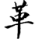
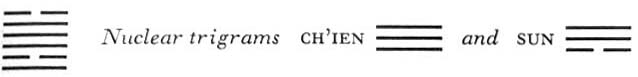

# Commentary: 49. Ko / Revolution (Molting)

The ruler of the hexagram is the nine in the fifth place, for a man must be in an honored place in order to have the authority to bring about a revolution. One who is central and correct is able to bring out all the good of such a revolution. Therefore it is said of this line: “The great man changes like a tiger.”

The Sequence

The setup of a well must necessarily be revolutionized in the course of time. Hence there follows the hexagram of REVOLUTION.

A well must be cleaned out from time to time or it will become clogged with mud. Therefore the hexagram Ching, THE WELL, which means a permanent setup, is followed by the hexagram of REVOLUTION, showing the need of changes in long-established institutions, in order to keep them from stagnating.

Miscellaneous Notes

REVOLUTION means removal of that which is antiquated.
The hexagram is so constructed that the influences of the two primary trigrams are in opposition; hence a revolution develops inevitably. Fire (Li), below, is quickened by the nuclear trigram Sun, meaning wind or wood. The upper nuclear trigram Ch’ien provides the necessary firmness. The entire movement of the hexagram is directed upward.

### THE JUDGMENT

> REVOLUTION. On your own day
>
> You are believed.
>
> Supreme success,
>
> Furthering through perseverance.
>
> Remorse disappears.

Commentary on the Decision

REVOLUTION. Water and fire subdue each other. Two daughters dwell together, but their views bar mutual understanding. This means revolution.

“On your own day you are believed”: one brings about a revolution and in doing so is trusted.

Enlightenment, and thereby joyousness: you create great success through justice.

If in a revolution one hits upon the right thing, “remorse disappears.”

Heaven and earth bring about revolution, and the four seasons complete themselves thereby.

T’ang and Wu<a id="ref-1" href="#/com-49-ko-revolution-molting?id=fn-1">1</a> brought about political revolutions because they were submissive toward heaven and in accord with men.

The time of REVOLUTION is truly great.

Molting depends on fixed laws; it is prepared in advance. The same is true of political revolutions. The expression “on your own day” points—as in the case of the hexagram Ku, WORK ON WHAT HAS BEEN SPOILED (18)—to one of the ten cyclic signs. These ten cyclic signs are: (1) Chia, (2) I, (3) Ping, (4) Ting, (5) Wu,<a id="ref-2" href="#/com-49-ko-revolution-molting?id=fn-2">2</a> (6) Chi, (7) Kêng, (8) Hsin, (9) Jên, (10) Kuei. As noted earlier in connection with hexagram 18, the eighth of these signs, Hsin metal, autumn, has also the secondary meaning of renewal, and the seventh, Kêng, means change. Now the sign before Kêng is Chi, hence it is on the day beforethe change takes place that one is believed (therefore the rendering “your own day”; *chi* also means “own”). If the cyclic signs are combined with the eight trigrams as correlated with the cardinal points in the Sequence of Later Heaven Inner-World Arrangement, it will be found that K’un stands for Chi—which means earth—in the southwest,<a id="ref-3" href="#/com-49-ko-revolution-molting?id=fn-3">3</a> midway between Tui in the west and Li in the south, that is, between the two trigrams that combat and subdue each other. The earth in the middle balances their influences, so that the clarity of fire (Li) and the joyousness of water (Tui) can manifest themselves separately. Hence the need of enlightenment and joyousness in gaining the popular confidence necessary for a revolution.

As revolutions in nature take place according to fixed laws and thus give rise to the cycle of the year, so political revolutions—these can become necessary at times for doing away with a state of decay—must follow definite laws. First, one must be able to await the right moment. Second, one must proceed in the right way, so that one will have the sympathy of the people and so that excesses will be avoided. Third, one must be correct and entirely free of all selfish motives. Fourth, the change must answer a real need. This was the character of the great revolutions brought about in the past by the rulers T’ang and Wu.

### THE IMAGE

> Fire in the lake: the image of REVOLUTION.
>
> Thus the superior man
>
> Sets the calendar in order
>
> And makes the seasons clear.

Fire in the lake causes a revolution. The water puts out the fire, and the fire makes the water evaporate. Arrangement of the calendar is suggested by Tui, which means a magician, acalendar maker. Making clear is suggested by Li, whose attribute is clarity.

### THE LINES

Nine at the beginning:

*a*) Wrapped in the hide of a yellow cow.

*b*) “Wrapped in the hide of a yellow cow.” One should not act thus.
One of the animals belonging to the trigram Li is the cow. The hide (*ko*) is suggested by the name of the hexagram, which means hide or molting. Yellow is the color of the second (middle) line, by which this first line is held fast. The present line is strong, and the trigram Li, to which it belongs, presses upward; thus it might be tempted to start a revolution. But the nine in the fourth place has no relationship with it, nor has the six in the second place, so that the moment for action has not yet come.

Six in the second place:

*a*) When one’s own day comes, one may create revolution.

Starting brings good fortune.

No blame.

*b*) “When one’s own day comes, one may create revolution.” Action brings splendid success.
This line is correct, central, and clear. The place is that of the official. As to connections above, it is in the relationship of correspondence to the ruler of the hexagram, the nine in the fifth place, and therefore has the potentiality of successful action. This is the moment indicated by the Judgment as being right for winning confidence (as regards the meaning of “one’s own day,” *chi jih*, cf. above). Here the configuration is especially clear: the trigram Li suggests day, while the middle line holds the place representing the earth, which stands in the southwest next to Li (south).

Nine in the third place:

*a*) Starting brings misfortune.

Perseverance brings danger.

When talk of revolution has gone the rounds three times,

One may commit himself,

And men will believe him.

*b*) “When talk of revolution has gone the rounds three times, one may commit himself.” If not, how far are things to be allowed to go?
This line is strong and clear and in the place of transition, but these very circumstances suggest danger of too great haste. Hence one should wait until the time is ripe. The relationship with the top line is not taken into account, because the latter is already bound to the fifth line. Therefore going prematurely would bring danger. If fire is to be effective against water, it must act with absolute determination. Success is possible only if all three lines form a single unit.

Nine in the fourth place:

*a*) Remorse disappears. Men believe him.

Changing the form of government brings good fortune.

*b*) The good fortune in changing the form of government is due to the fact that one’s conviction meets with belief.
As a strong line in a yielding place, this line is harmoniously balanced. It is like in kind to the ruler of the hexagram and in alliance with him, hence it meets with belief. Here the time for change has come. When the text speaks not only of revolution but also of change and alteration, it means that while revolution merely does away with the old, the idea of change points at the same time to introduction of the new.

Nine in the fifth place:

*a*) The great man changes like a tiger.

Even before he questions the oracle

He is believed.

*b*) “The great man changes like a tiger”: his marking is distinct.
This line is related to the six in the second place and therefore has the clarity of Li at its disposal. The trigram Tui, in which this is the central line, stands in the west, the place of the white tiger. The season of the year corresponding with this trigram is autumn, when animals change their coats.

Six at the top:

*a*) The superior man changes like a panther.

The inferior man molts in the face.

Starting brings misfortune.

To remain persevering brings good fortune.

*b*) “The superior man changes like a panther.” His marking is more delicate.

“The inferior man molts in the face.” He is devoted and obeys the prince.

---

**Notes:**

<a id="fn-1" href="#/com-49-ko-revolution-molting?id=ref-1">**1.**</a> T’ang the Completer (see here); Wu Wang, son of King Wên.

<a id="fn-2" href="#/com-49-ko-revolution-molting?id=ref-2">**2.**</a> Wu=Mou. See here for a discussion of the cyclic signs.

<a id="fn-3" href="#/com-49-ko-revolution-molting?id=ref-3">**3.**</a> Mou and Chi do not appear in the diagram showing the cyclic signs in relation to the trigrams in the Inner-World Arrangement (see here), since this pair of cyclic signs stands for the center, not for one of the cardinal points. K’un is connected with Mou and Chi: since it too symbolizes the center, The cyclic signs and the primary trigrams represent two different systems of speculation, the one base on the “five stages of change,” the other on the dualism of yin an yang. Therefore the two systems cannot coincide point for point.
