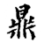
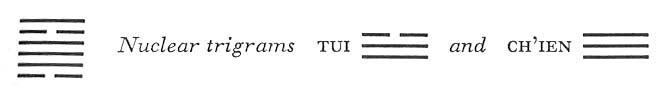

# Commentary: 50. Ting / The Caldron

The rulers of the hexagram are the six in the fifth place and the nine at the top. The idea on which the hexagram Ting is based is that of the nourishing of worthy men. The six in the fifth place honors the venerable man represented by the nine at the top. The image is derived from the way in which the rings and ears of the *ting*<a id="ref-1" href="#/com-50-ting-the-caldron?id=fn-1">1</a> fit into each other.

The Sequence

Nothing transforms things so much as the *ting*. Hence there follows the hexagram of THE CALDRON.

The transformations wrought by Ting are on the one hand the changes produced in food by cooking, and on the other, in a figurative sense, the revolutionary effects resulting from the joint work of a prince and a sage.

Miscellaneous Notes

THE CALDRON means taking up the new.
The hexagram is structurally the inverse of the preceding one; in meaning also it presents a transformation. While Ko treats of revolution as such in its negative aspect, Ting shows the correct way of going about social reorganization. The two primary trigrams move in such a way that their action ismutually reinforcing. The nuclear trigrams Ch’ien and Tui, which mean metal, complete the idea of the *ting* as a sacred ceremonial vessel. These old bronze vessels—as still occasionally found in excavations—have been connected throughout all time with the loftiest expressions of Chinese civilization.

### THE JUDGMENT

> THE CALDRON. Supreme good fortune.
>
> Success.

Commentary on the Decision

THE CALDRON is the image of an object. When one causes wood to penetrate fire, food is cooked. The holy man cooks in order to sacrifice to God the Lord, and he cooks feasts in order to nourish the holy and the worthy.

Through gentleness the ear and eye become sharp and clear. The yielding advances and goes upward. It attains the middle and finds correspondence in the firm; hence there is supreme success.

The whole hexagram, with its sequence of divided and undivided lines, is the image of a *ting*, from the legs below to the handle rings at the top. The trigram Sun below means wood and penetration; Li above means fire. Thus wood is put into fire, and the fire is kept up for the preparation of the meal. Strictly speaking, food is of course not cooked in the *ting* but is served in it after being cooked in the kitchen; nevertheless, the symbol of the *ting* carries also the idea of the preparation of food. The *ting* is a ceremonial vessel reserved for use in sacrifices and banquets, and herein lies the contrast between this hexagram and Ching, THE WELL (48), which connotes nourishment of the people. In a sacrifice to God only one animal is needed, because it is not the gift but the sentiment that counts. For the entertainment of guests abundant food and great lavishness are needed. The upper trigram Li is eye, the fifth line stands for the ears of the *ting*; thus the image of eye and ear is suggested. The lower trigram Sun is the Gentle, the adaptive.Thereby the eye and ear become sharp and clear (clarity is the attribute of the trigram Li).

The yielding element that moves upward is the ruler of the hexagram in the fifth place; it stands in the relationship of correspondence to the strong assistant, the nine in the second place, hence has success. In ancient China nine *ting* were the symbol of sovereignty, hence the favorable oracle.

### THE IMAGE

> Fire over wood:
>
> The image of THE CALDRON.
>
> Thus the superior man consolidates his fate
>
> By making his position correct.

Fire over wood is the image not of the *ting* itself but of its use. Fire burns continuously when wood is under it. Life also must be kept alight, in order to remain so conditioned that the sources of life are perpetually renewed. Obviously the same is true of the life of a community or of a state. Here too relationships and positions must be so regulated that the resulting order has duration. In this way the decree of fate whereby rulership falls to a particular house becomes established.

### THE LINES

Six at the beginning:

*a*) A *ting* with legs upturned.

Furthers removal of stagnating stuff.

One takes a concubine for the sake of her son.

No blame.

*b*) “A *ting* with legs upturned.” This is still not wrong.

“Furthers removal of stagnating stuff,” in order to be able to follow the man of worth.
The line at the bottom means the legs of the *ting*.<a id="ref-2" href="#/com-50-ting-the-caldron?id=fn-2">2</a> Since the line is weak and stands at the beginning, the implication arisesthat before cooking one must turn the *ting* upside down to throw out the old food remnants. The line has a connection by position with the central and strong line next to it; hence the idea of a concubine (weak and subordinated).

Nine in the second place:

*a*) There is food in the *ting*.

My comrades are envious,

But they cannot harm me.

Good fortune.

*b*) “There is food in the *ting*.” Be cautious about where you go.

“My comrades are envious.” This brings no blame in the end.
This line is firm and central, hence it symbolizes the contents of the *ting*. It forms a unit with the third and fourth lines, but as it stands in the relationship of correspondence to the ruler of the hexagram, it must go its own ways as prescribed for it by these relationships. This leads on the other hand to envy from its comrades, the two lines from which it is separated by inner relationships. But being quite free of possible entanglements and shielded by the strong relationship to the ruler, it need fear nothing.

Nine in the third place:

*a*) The handle of the *ting* is altered.

One is impeded in his way of life.

The fat of the pheasant is not eaten.

Once rain falls, remorse is spent.

Good fortune comes in the end.

*b*) “The handle of the *ting* is altered.” He has missed the idea.
This line is the lowest in the upper nuclear trigram Tui, whose top line means mouth. It might therefore be assumed that the, contents, indicated by the upper trigram Li, which means pheasant, are eaten, but this is not the case. The vessel is notportable, because the handle has been altered. This is suggested by the fact that the present line, which ordinarily would be related to the top line, representing the carrying rings, is itself firm not hollow and therefore cannot receive the carrying rings (cf. on the other hand the six in the fifth place). There is a promise for the future. As the line changes, K’an, meaning rain, takes shape as the lower primary trigram and upper nuclear trigram. The situation is made easier by this. The stoppage ceases, and the movement leads to the goal.

Nine in the fourth place:

*a*) The legs of the *ting* are broken.

The prince’s meal is spilled

And his person is soiled.

Misfortune.

*b*) “The prince’s meal is spilled.” How can one still trust him?
This line stands in the relationship of correspondence to the six at the beginning, the line suggesting the upturned legs of a *ting*. The latter situation is not of grave import, for the *ting* is still empty; here, however, the matter is serious, since the *ting* contains food. It is therefore not simply an overturning: the legs of the *ting* are broken, and the prince’s meal is spilled. In conformity with the place, there should be a relationship with the ruler of the hexagram, the six in the fifth place, either that of holding together or that of receiving. But the relationship with the six at the beginning interferes. This points to a disastrous split between character and position, between knowledge and aspirations, between strength and responsibility.

Six in the fifth place:

*a*) The *ting* has yellow handles, golden carrying rings.

Perseverance furthers.

*b*) The yellow handles of the *ting* are central, in order to receive what is real.
This line is centrally placed in the upper trigram Li; it is moreover the middle line of the trigram K’un, which is associated with the color yellow. The carrying rings are of metal because the upper nuclear trigram Tui means metal. The carrying rings (which in ancient Chinese vessels are usually linked together) are no doubt represented by the strong line at the top. This line is in contrast with the nine in the third place: the handle is hollow and can therefore receive the “real” (i.e., firm) carrying rings, and the vessel can be carried.

In the language of symbols this means a great deal. The line is the ruler of the hexagram and has over it a sage (the nine at the top), with whom it is connected by position and complementary relationship. The ruler is “hollow” receptive, hence capable of receiving the power, that is, the teachings of this sage (“handle,” *erh*, is represented by the same character as “ear”). Thereby he makes progress.

Nine at the top:

*a*) The *ting* has rings of jade.

Great good fortune.

Nothing that would not act to further.

*b*) The jade rings in the highest place show the firm and the yielding complementing each other properly.
This situation is the same as that of the six in the fifth place, except that here it is seen from the standpoint of the sage who bestows. What appears in the six in the fifth place as the firmness of metal manifests itself here as the soft sheen of jade. It is possible for the sage to impart his teaching because the six in the fifth place meets him halfway with the proper receptivity.

---

**Notes:**

<a id="fn-1" href="#/com-50-ting-the-caldron?id=ref-1">**1.**</a> See here, n. 1.

<a id="fn-2" href="#/com-50-ting-the-caldron?id=ref-2">**2.**</a> The *ting* of ancient China had either three legs or four. Since the divided line at the beginning touches the earth as it were at only two points, it suggests the idea of a *ting* upturned.
