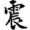
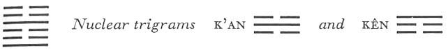

# Commentary: 51. Chên / The Arousing (Shock, Thunder)

The rulers of the hexagram Chên are the two light lines. But since it is implicit in the idea of the hexagram of SHOCK that the light element is moving upward from below, the fourth line is not regarded as a ruler, and only the line at the beginning is so considered.

The Sequence

Among the custodians of the sacred vessels, the eldest son stands first. Hence there follows the hexagram of THE AROUSING. The Arousing means movement.

Miscellaneous Notes

THE AROUSING means beginning, arising.
This hexagram is one of the eight in which a primary trigram is doubled. It is formed by doubling of the trigram Chên, which symbolizes the eldest son, the beginning of things in the east—the spring. This is also suggested by the Image, which shows the upward movement of electricity, thunder, making itself heard again in the spring.

### THE JUDGMENT

> SHOCK brings success.
>
> Shock comes—oh, oh!
>
> Laughing words—ha, ha!
>
> The shock terrifies for a hundred miles,
>
> And he does not let fall the sacrificial spoon and chalice.

Commentary on the Decision

“SHOCK brings success. Shock comes—oh, oh!” Fear brings good fortune.

“Laughing words—ha, ha!” Afterward one has a rule.

“The shock terrifies for a hundred miles.” If one causes fear far and wide and has concern for what is near by, one may come forth and protect the temple of the ancestors and the altar of the earth, and be the leader of the sacrifice.

“Shock comes—oh, oh”: the exclamatory words mean first a frightened tiger, then a lizard running in fright hither and thither on the wall. Thus the meaning of fear became attached to the two onomatopoeic characters. The fear thus aroused makes one cautious, and caution brings good fortune. “Laughing words—ha, ha”: the words are suggested by the sound of thunder, which sounds like “ha, ha.” They are a symbol of inner calm in the midst of the storm of outer movement.

“The shock terrifies for a hundred miles”: this is the sound of thunder, which is at the same time the symbol of a mighty ruler (suggested by the idea of the eldest son) who knows how to make himself respected by all those about him, yet is careful and exact in the smallest detail. The concluding sentence also refers to this. The lord of the sacrifices is at the same time the lord of the house or of the realm. In this regard also the eldest son had his special task. The trigram Chên means the coming forth of God in the spring and also the reawakening of the life force, which stirs again from below.

### THE IMAGE

> Thunder repeated: the image of SHOCK.
>
> Thus in fear and trembling
>
> The superior man sets his life in order
>
> And examines himself.

The phrase is “thunder repeated” because the trigram Chên is doubled. The first thunder denotes fear and trembling, the second denotes shaping and exploring.

### THE LINES

Nine at the beginning:

*a*) Shock comes—oh, oh!

Then follow laughing words—ha, ha!

Good fortune.

*b*) “Shock comes—oh, oh!” Fear brings good fortune.

“Laughing words—ha, ha!” Afterward one has a rule.
A part of the Judgment, and of the commentary on it, is given here word for word, as is occasionally done in the case of the ruler of a hexagram. The strong line at the beginning initiating the movement from below shows the quintessence of the whole situation.

Six in the second place:

*a*) Shock comes bringing danger.

A hundred thousand times

You lose your treasures

And must climb the nine hills.

Do not go in pursuit of them.

After seven days you will get them back again.

*b*) “Shock comes bringing danger.” It rests upon a firm line.
Since the first line presses upward with powerful shock, there can be no thought of a relationship of holding together between it and this weak line in a weak place. But the line is central and correct, and is therefore affected only externally by the threatening danger, just as a thunderstorm causes only momentary shock. Danger is indicated by the nuclear trigram K’an, under which the line stands. Flight to the hills is suggested by the lower nuclear trigram Kên, mountain. Seven is the numberindicating return, which restores the old conditions after the situations of all of the six lines have changed.

Six in the third place:

*a*) Shock comes and makes one distraught.

If shock spurs to action

One remains free of misfortune.

*b*) “Shock comes and makes one distraught.” The place is not the appropriate one.
The word *su*, here rendered by “distraught,” denotes literally the reviving movements of insects still numb and stiff after their winter sleep. The place is not the proper one, for the place is strong and the line weak; therefore it is not equal to the shock of the position. Hence it must allow itself to be set in motion by the shock. Through movement a weak line becomes a strong line. Thus one becomes equal to shock.

Nine in the fourth place:

*a*) Shock is mired.

*b*) “Shock is mired.” It is not yet brilliant enough.
The line itself is strong, but its strength is impaired by the weakness of the place. Furthermore, it is in the nuclear trigram K’an, just where the pit lies, and also at the top of the nuclear trigram Kên, Keeping Still. Thus the strong nature of the line cannot become effectual; it does not show enough brilliance, hence is caught fast in the mire.

Six in the fifth place:

*a*) Shock goes hither and thither.

Danger.

However, nothing at all is lost.

Yet there are things to be done.

*b*) “Shock goes hither and thither. Danger.” One walks in danger.

The “things to be done” are in the middle, hence nothing at all is lost.
The line is central, like the six in the second place. But while in the latter case danger threatens (nuclear trigram K’an), here it has been overcome and one is already on the hill (nuclear trigram Kên). Hence one loses nothing. The point is to hold firmly to the central position and thus to conserve for oneself the strength inherent in it—the fifth place being the place of the ruler. The six in the second place is the official. An official may lose his property temporarily, but all of it can be replaced. The six in the fifth place, however, is the ruler; and his possessions consist of land and people. These must not be lost. Such loss can be prevented if one maintains a central position and behaves correctly.

Six at the top:

*a*) Shock brings ruin and terrified gazing around.

Going ahead brings misfortune.

If it has not yet touched one’s own body

But has reached one’s neighbor first,

There is no blame.

One’s comrades have something to talk about.

*b*) “Shock brings ruin.” He has not attained the middle.

Misfortune, but no blame. One is warned by the fear for one’s neighbor.
This line is related to the third, which is the comrade who has something to say. The fifth line is the neighbor. Here a weak line stands at the climax of shock and is therefore inherently not equal to it. The shock threatens ruin as in an earthquake, hence the terrified gazing around. Trying to undertake something under such conditions would lead to misfortune. But if one takes warning from the experience of one’s neighbor—in this case the fifth line—and remains calm, mistakes are avoided. The third line, the comrade, is forced by the situation to move, hence cannot understand why the sixth line stays calm. However, the difference in behavior is the result of the difference in place. Therefore one must be wholly independent in one’s actions.
