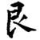
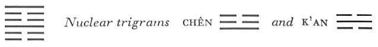

# Commentary: 52. Kên / Keeping Still, Mountain

Here also, strictly speaking, the two light lines are the rulers of the hexagram. But since the meaning of the hexagram of KEEPING STILL is based on the fact that the light element stands still, the third line does not count as a ruler, and only the line at the top is so regarded.

The Sequence

Things cannot move continuously, one must make them stop. Hence there follows the hexagram of KEEPING STILL. Keeping Still means stopping.

Miscellaneous Notes

KEEPING STILL means stopping.
This hexagram is the inverse of the preceding one. It is formed by doubling of the trigram Kên, the youngest son, the mountain. The place of Kên is in the northeast, between K’an in the north and Chên in the east. It is the mysterious place where all things begin and end, where death and birth pass one into the other. The attribute of the hexagram is keeping still, because the strong lines, whose trend is upward, have attained their goal.

### THE JUDGMENT

> KEEPING STILL. Keeping his back still
>
> So that he no longer feels his body.
>
> He goes into his courtyard
>
> And does not see his people.
>
> No blame.

Commentary on the Decision

KEEPING STILL means stopping.

When it is time to stop, then stop.

When it is time to advance, then advance.

Thus movement and rest do not miss the right time,

And their course becomes bright and clear.

Keeping his stopping still<a id="ref-1" href="#/com-52-k-n-keeping-still-mountain?id=fn-1">1</a> means stopping in his place. Those above and those below are in opposition and have nothing in common. Therefore it is said: “He does not feel his body. He goes into his courtyard and does not see his people. No blame.”

The nature of the hexagram predicates a separation of the upper and the lower trigram. This is indicated also by the divergent movements of the nuclear trigrams, the upper going upward and the lower downward. Keeping still is the meaning of the hexagram itself, movement is the meaning of the nuclear trigrams. Therefore it is explained that movement and stopping, each at the right time, are both features of rest: the one is continuance in a state of movement, the other continuance in a state of rest. The hexagram Kên has an inner brilliance, because the light line at the top is above the two dark ones and so is not darkened; hence the saying: “Their course becomes bright and clear.”

The back is that part of the body which is invisible to oneself; keeping the back still symbolizes making the self still. The lower primary trigram indicates this keeping still of the back, so that one is no longer aware of one’s body, that is, of one’s personality. The upper primary trigram means courtyard. Theindividual lines of the upper trigram have no relation to the corresponding lines of the lower trigram, hence the upper and the lower trigram turn their backs on each other, as it were. Hence one does not see the other persons in the courtyard.

### THE IMAGE

> Mountains standing close together:
>
> The image of KEEPING STILL.
>
> Thus the superior man
>
> Does not permit his thoughts
>
> To go beyond his situation.

The corresponding lines of the upper and the lower trigram do not stand in the relationship of correspondence in any of the hexagrams formed by doubling of a trigram. But only in the hexagram of KEEPING STILL is it expressly noted that the mountains have merely an outward connection; in the case of the other hexagrams so formed, a reciprocal movement of the trigrams is always presupposed. In KEEPING STILL the opposite of movement and interchange is represented. Accordingly, the lesson taught by the Image is that of restriction to what is within the limits of one’s position.

### THE LINES

Six at the beginning:

*a*) Keeping his toes still.

No blame.

Continued perseverance furthers.

*b*) “Keeping his toes still”: what is right is not yet lost.
With respect to their images, the individual lines in this hexagram are reminiscent of the lines of Hsien, INFLUENCE (31). Thus the lowest line is again the symbol of the toes. The line is weak, therefore keeping still accords with the time and is not a mistake. It is important only that a weak nature of this sort should not become impatient but should possess enough perseverance to keep still.

Six in the second place:

*a*) Keeping his calves still.

He cannot rescue him whom he follows.

His heart is not glad.

*b*) “He cannot rescue him whom he follows.” Because this one does not turn toward him to listen to him.
The line that is followed by the six in the second place is the nine in the third place. The six in the second place is correct and central and would like to save not only itself but also the one it follows. But the nine in the third place is a strong line in the place of transition, and it is the lowest line of the nuclear trigram Chên, the Arousing; hence it is extremely restless. At the same time it is in the nuclear trigram K’an, the Abysmal, which means earache, hence the failure to hear. K’an is also the symbol of the heart; hence, “His heart is not glad.”

Nine in the third place:

*a*) Keeping his hips still.

Making his sacrum stiff.

Dangerous. The heart suffocates.

*b*) “Keeping his hips still.” There is danger that the heart may suffocate.
This line is in the middle of the nuclear trigram K’an, hence the allusion to the heart. At the same time it is the one light line between dark lines, and this indicates danger and confinement. Keeping still in this situation is dangerous. When the back is kept still one gains control over the whole body. The hips, however, form the boundary between the movements of the light and the dark forces. If rigidity occurs here, the heart will move aimlessly, the nerve paths will thereby be interrupted, and a suffocation of the heart is to be feared.

Six in the fourth place:

*a*) Keeping his trunk still.

No blame.

*b*) “Keeping his trunk still.” He stops within his own body.
The fourth place is the trunk. It is very weak, and a weak line stands over it. In the time of KEEPING STILL it is altogether correct if one knows how to restrain oneself at the right time.

Six in the fifth place:

*a*) Keeping his jaws still.

The words have order.

Remorse disappears.

*b*) “Keeping his jaws still,” as a result of central and correct behavior.
While in INFLUENCE (31) the image of the jaws does not appear until the topmost place is reached, it comes in the fifth place here, because in this hexagram the ruler occupies the sixth place.

The present line is in a central place and also correct. But since it belongs simultaneously to the trigram Kên, Keeping Still, and to the nuclear trigram Chên, movement, it suggests the possibility of movement of the jaws and of speaking like thunder. But this is avoided through the central behavior of the line and the fact that it belongs to the upper trigram, Keeping Still.

Nine at the top:

*a*) Noblehearted keeping still.

Good fortune.

*b*) The good fortune of noblehearted keeping still comes from the fact that there is an ample end.
This line ending the hexagram is strong, hence it is thought of as ample. The ruler of the hexagram is at the top of the mountain, in the place where the layers of earth are most amply (most densely) piled upon one another. As the highest line it has light intrinsically; this can be fully effectual precisely because of the calm keeping still of the line. Hence good fortune is attained here. Since this strong line does not strive further upward but stays quietly in its place, it is, in contrast to other strong lines at the top, not unfavorable.

---

**Notes:**

<a id="fn-1" href="#/com-52-k-n-keeping-still-mountain?id=ref-1">**1.**</a> This phrase, “Keeping his stopping still” (*kên ch’i chih*), is a textual mistake persisting from Wang Pi’s time A.D. 226-249; it should read as the Judgment has it: “Keeping his back still” (*kên ch’i pei*). A comparison of the older explanations makes this evident.
