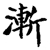
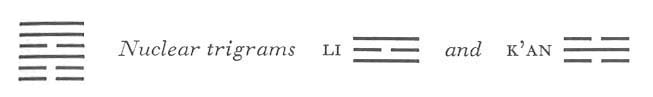

# Commentary: 53. Chien / Development (Gradual Progress)

The basic idea of the hexagram of DEVELOPMENT is the marriage of a girl. Only the six in the second place stands in the relationship of correspondence to the nine in the fifth. It represents the girl who is to be married. Hence the six in the second place is a ruler of the hexagram. However, development also connotes progress, and the nine in the fifth place has progressed, occupies a high position, and has a firm and central character; hence it also is a ruler of the hexagram.

The Sequence

Things cannot stop forever; hence there follows the hexagram of DEVELOPMENT. Development means to progress.

Miscellaneous Notes

DEVELOPMENT shows how the maiden is given in marriage and in this must await the actions of the man.
Like the hexagrams Chin, PROGRESS (35), and Shêng, PUSHING UPWARD (46), this hexagram pictures progress. But while PROGRESS is like the rising sun spreading light over the earth, and Shêng shows a tree pushing up through the earth, what is meant here is slow growth such as that of a tree on a mountainside. In another aspect the hexagram is one of those dealingwith the relation of man and woman, and therefore most closely related to the hexagram Hsien, INFLUENCE (31). In the latter the youngest daughter is being influenced by the youngest son. The effect is quick and mutual, expressing the natural attraction between the sexes. In the present hexagram, the mature elder daughter is being influenced by the youngest son; hence in this instance the emphasis is rather on the mores with their restraining effect. Thus we are reminded here of the gradual development in the case of marriage, which in the course of time came to require the carrying out of six different rites (cf. the next hexagram).

### THE JUDGMENT

> DEVELOPMENT. The maiden
>
> Is given in marriage.
>
> Good fortune.
>
> Perseverance furthers.

Commentary on the Decision

The progress of DEVELOPMENT means the good fortune of the maiden’s marriage.

Progressing and thereby attaining the right place: going brings success.

Progressing in what is right-thus one may set the country in order.

His place is firm, and he has attained the middle. Keeping still and penetrating: this makes the movement inexhaustible.

The meaning of the name of the hexagram is explained in terms of the first part of the Judgment, the rest of which is elucidated on the basis of the structure of the hexagram. The two rulers of the hexagram, the second and the fifth line, show a progressing and therefore attain their correct and natural places. Attainment of a proper place bespeaks a correct attitude of mind; there by undertakings meet with success, and the state can be set in order. The emphasis here is on the combination of personal moral effort and such strength as isrequired to set the state in order. The ruler of the hexagram, standing in the fifth place—that of command—combining strength and central correctness, is especially well qualified for achieving successful results of this kind. The latter part of the commentary deals with the two primary trigrams and points out that the inexhaustible source of progress is inner calm combined with adaptability to circumstances. Calm is the attribute of the inner trigram, Kên, adaptability that of the outer trigram, Sun.

### THE IMAGE

> On the mountain, a tree:
>
> The image of DEVELOPMENT.
>
> Thus the superior man abides in dignity and virtue,
>
> In order to improve the mores.

The tree on the mountain grows larger slowly and imperceptibly. It spreads and gives shade, and thus through its nature influences its surroundings. Thus it is an example of the active power by which an individual improves the mores of his environment through consistent cultivation of his own moral qualities. The tree on the mountain, like the tree on the earth in Kuan, VIEW (20), represents influence by example. The keeping still of the mountain is a symbol for abiding in dignity and virtue. The penetrating attribute of wood (or wind) is a symbol of the positive influence emanating from a good example.

### THE LINES

The hexagram as a whole refers to the contracting of marriage, and consequently the image common to all the lines is the wild goose, symbol of conjugal fidelity.

Six at the beginning:

*a*) The wild goose gradually draws near the shore.

The young son is in danger.

There is talk. No blame.

*b*) The danger besetting the little son implies no blame.
The nuclear trigram Li means a flying bird, hence the image of a wild goose. The first line stands next to the nuclear trigram K’an, the Abysmal, hence the shore as an image. Kên, the lower trigram, symbolizes the youngest son. It contains the nuclear trigram K’an, danger. The “talk” comes perhaps from the upper trigram Sun, wind, which soughs and resounds.

This is a yielding line in a lowly<a id="ref-1" href="#/com-53-chien-development-gradual-progress?id=fn-1">1</a> place. Therefore it is not impetuous in pressing forward; it is conscious of the danger. Hence, though others talk about it, it remains blameless.

Six in the second place:

*a*) The wild goose gradually draws near the cliff.

Eating and drinking in peace and concord.

Good fortune.

*b*) “Eating and drinking in peace and concord”: he does not merely eat his fill.
Kên is the mountain, hence the image of a cliff. The nuclear trigram K’an indicates eating and drinking. When the wild goose finds food, it calls its comrades. This line is yielding and related to the nine in the fifth place, which it calls. It does not eat to satisfy itself alone but takes thought at once of others as well.

Nine in the third place:

*a*) The wild goose gradually draws near the plateau.

The man goes forth and does not return.

The woman carries a child but does not bring it forth.

Misfortune.

It furthers one to fight off robbers.

*b*) “The man goes forth and does not return.” He leaves the group of his companions.

“The woman carries a child but does not bring it forth.” She has lost the right way.

“It furthers one to fight off robbers.” Devotion and mutual protection.
This line, as the uppermost one in the trigram Kên, indicates a high place, hence the plateau. It is a strong line in a strong place, hence not moderate in movement. It pictures a man who never desists from his course and who therefore proceeds without ever turning back. It stands in relationship to the two strong lines at the top, but there is no correspondence. Further, it is in the middle of the nuclear trigram of danger and is therefore separated from its own kind (a dark line above, another below it). Since the line does not return, the trigram K’un, forming below as a result of its departure, is left behind without a child. Thus the woman has lost her way. Only in so far as this strong line protects the two weak ones under it from robbers, does it have any furthering quality.

Six in the fourth place:

*a*) The wild goose gradually draws near the tree.

Perhaps it will find a flat branch. No blame.

*b*) “Perhaps it will find a flat branch.” It is devoted and gentle.
This line has entered the upper trigram Sun, wood, hence the image of its gradually approaching a tree. The tree itself affords no foothold for the wild goose, whose feet are not made for clutching; but through adaptability and devotion it may find a flat branch. This is a weak line in a weak place, hence correct. It is therefore adaptable and cautious, and thus temporarily finds a resting place.

Nine in the fifth place:

*a*) The wild goose gradually draws near the summit.

For three years the woman has no child.

In the end nothing can hinder her.

Good fortune.

*b*) In the end nothing can hinder good fortune. One attains one’s wish.
This line is the upper ruler of the hexagram, hence it is the summit to which the wild goose draws near. It stands in relationship to the lower ruler of the hexagram, the six in the second place; the correspondence between the two places is analogous to the relation of husband and wife. Hence the idea that union finally takes place. But this takes three years, for the line is separated from the six in the second place by the nuclear trigram K’an, danger. However, the union is based on natural affinity; hence it can be delayed but not permanently prevented.

Nine at the top:

*a*) The wild goose gradually draws near the cloud heights.

Its feathers can be used for the sacred dance.

Good fortune.

*b*) “Its feathers can be used for the sacred dance. Good fortune.” He is not to be disconcerted.
The place at the top is the region of the clouds, and here the character *lu*, really meaning a plateau (cf. the nine in the third place) has mistakenly been written in place of another character meaning “highest heights.”

The trigram Sun means wind. This suggests flight through the clouds. The line is strong and already outside the affairs of the world. It is regarded by the others solely as an example and thus exerts a beneficent influence. It no longer enters into the confusion of mundane affairs.

The dances mentioned were sacred pantomimes in which feathers of a special sort were used. The idea inhering in this line recalls that of the top line of Kuan, VIEW (20). In the latter too the line as such “stands outside the affairs of the world, taking part only as a spectator.

---

**Notes:**

<a id="fn-1" href="#/com-53-chien-development-gradual-progress?id=ref-1">**1.**</a> “Yielding” in the German, but this is assumed to be a slip of the pen. See here, n. 1.
