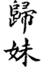
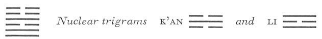

# Commentary: 54. Kuei Mei / The Marrying Maiden

The hexagram of THE MARRYING MAIDEN is based on the idea that the girl is marrying on her own initiative. Her character is not good, therefore the Commentary on the Decision says: “ ‘Nothing that would further.’ The yielding rests upon the hard.” This refers to the six in the third place and to the six at the top, which are thus the constituting rulers of the hexagram. The six in the fifth place, on the other hand, is in the place of honor and associates with those below; thus it changes what is not good into good and transforms misfortune into good fortune. Because of this the six in the fifth place is the governing ruler of the hexagram.

The Sequence

Through progress one is sure to reach the place where one belongs. Hence there follows the hexagram of THE MARRYING MAIDEN.<a id="ref-1" href="#/com-54-kuei-mei-the-marrying-maiden?id=fn-1">1</a>

Miscellaneous Notes

THE MARRYING MAIDEN shows the end of maidenhood.
This hexagram is judged in very different ways. In later times it was considered immoral for a girl to marry on her own initiative. The mores demanded that the girl wait for theman to take the lead, as set forth in the preceding hexagram. This goes back to patriarchal times. But the present hexagram has also so to speak a cosmic meaning. For, according to the arrangement of the eight trigrams by King Wên Inner-World Arrangements<a id="ref-2" href="#/com-54-kuei-mei-the-marrying-maiden?id=fn-2">2</a>, the upper trigram Chên belongs in the east and denotes spring, the beginning of life; the lower trigram Tui belongs in the west and denotes autumn, the end of life, and the two nuclear trigrams K’an and Li represent the north (winter) and the south (summer) respectively. Consequently the whole cycle of life is contained in this hexagram.

### THE JUDGMENT

> THE MARRYING MAIDEN.
>
> Undertakings bring misfortune.
>
> Nothing that would further.

Commentary on the Decision

THE MARRYING MAIDEN describes the great meaning of heaven and earth. If heaven and earth do not unite, all creatures fail to prosper.

THE MARRYING MAIDEN means the end and beginning of humanity.

Joyousness in movement: she who marries is the young girl.

“Undertakings bring misfortune.” The places are not the appropriate ones.

“Nothing that would further.” The yielding rests upon the hard.

In the sequence of the trigrams in the Primal Arrangement,<a id="ref-3" href="#/com-54-kuei-mei-the-marrying-maiden?id=fn-3">3</a> which corresponds with the world of the idea, Ch’ien is in the south and K’un in the north; Li is in the east as the sun and K’an in the west as the moon. In the Inner-World Arrangement, which corresponds with the phenomenal world, the action is transferred to the four trigrams Chên (east), Li (south),Tui (west), and K’an (north). Sun and moon here take the place of heaven and earth as active forces. Heaven, Ch’ien, has withdrawn to the northwest, and the eldest son, Chên, in the east, is the originator of life. The earth, K’un, has withdrawn to the southwest, and the youngest daughter, Tui, in the west, presides over harvest and birth. Thus the present hexagram indicates the cosmic order of the relations of the sexes and the cycle of life.

The interpretation given by Liu Yüan<a id="ref-4" href="#/com-54-kuei-mei-the-marrying-maiden?id=fn-4">4</a> in the *Chou I Hêng Chieh* is significant. He sees in the hexagram not the maiden (Tui) following an older man (Chên), but the elder brother (Chên) leading his younger sister to her husband. A certain basis for this view is afforded by the words accompanying the fifth line. We are dealing here with reminiscences of matriarchal times disseminated in popular romance by the story of how Chung K’uei gave his sister in marriage.

THE MARRYING MAIDEN means the beginning and end of humanity, as Chên in the east means spring, ascent, and Tui in the west means autumn, decline. The commentary then explains the name of the hexagram by citing the attributes of the two trigrams—Tui, joyousness, and Chên, movement. The judgment on the hexagram, “Undertakings bring misfortune,” is derived from the position of the four middle lines, none of which is in its proper place. “Nothing that would further” results from the position of the six in the third place (one of the rulers of the hexagram), which is over the hard nine in the second place, and from the positions of the other two rulers, the six in the fifth place and the six at the top, both over the hard nine in the fourth place.

### THE IMAGE

> Thunder over the lake:
>
> The image of THE MARRYING MAIDEN.
>
> Thus the superior man
>
> Understands the transitory
>
> In the light of the eternity of the end.

In the autumn everything comes to its end. When thunder is over the lake, this end is near. The eternity of the end is suggested by the trigram Chên, which comes forth in the east (spring) and reaches the end of its activity in the west (autumn), in accordance with fixed laws. At that moment the death-dealing power of autumn, which destroys all transient beings, becomes active. Through knowledge of these laws, one reaches those regions which are beyond beginning and end, birth and death.

### THE LINES

Nine at the beginning:

*a*) The marrying maiden as a concubine.

A lame man who is able to tread.

Undertakings bring good fortune.

*b*) “The marrying maiden as a concubine,” because that gives duration.

“A lame man who is able to tread. Good fortune,” because they receive each other.
This line is at the bottom, in an inferior position. Furthermore, it is in the trigram Tui, the youngest daughter; hence the idea of a concubine. Tui, the youngest daughter, is weak in relation to the eldest son (just as Tui is weak in relation to Ch’ien in hexagram 10, Lü, TREADING, in which the image of a lame, one-eyed man likewise occurs). The lowest line stands for the foot, hence the idea of a lame man, because there is no relationship with the fourth line. “Receive each other” means that the first line is in the relationship of receiving to the second, serving the latter line as well as the fifth; therefore it is able to accomplish something indirectly at least, and advances.

Nine in the second place:

*a*) A one-eyed man who is able to see.

The perseverance of a solitary man furthers.

*b*) “The perseverance of a solitary man furthers.” The permanent law is not changed.
This line is in the lowest place of the nuclear trigram Li, which means eye. It stands in the relationship of correspondence to the fifth line, which is weak; hence the image of a one-eyed man.

Since the line is strong and central, it is not changed, although the line that belongs to it is weak and not good. It is true that this brings it into darkness and loneliness—it is under the nuclear trigram K’an, abyss, that is, a gloomy valley—but it does not change its attitude toward the law and remains faithful to its duty.

Six in the third place:

*a*) The marrying maiden as a slave.

She marries as a concubine.

*b*) “The marrying maiden as a slave”: she is not yet in the appropriate place.
This is a weak line in a strong place, hence not in the appropriate position. Moreover, it stands at the high point of pleasure, hence throws itself away as the lowest type of slave, merely in order to achieve marriage at any cost. In following the nine in the second place, it finds shelter as a concubine.

Nine in the fourth place:

*a*) The marrying maiden draws out the allotted time.

A late marriage comes in due course.

*b*) The state of mind that leads to drawing out of the allotted time indicates a desire to wait for something before going.
Of the lines of the upper and the lower trigram, only the fifth and the second line stand in relationship. But while the other two lines in Tui, being in the trigram of pleasure, also seek a marital connection (although by a detour around the second line), the lines of the upper trigram that are not bound by the relationship of correspondence move away from the idea of marriage. The present line, besides having no correspondence in the lower trigram, is not in the proper place (a strong line in a weak place) and is in the center of the nuclear trigram K’an, danger. Hence it holds back from marriage and waits forconditions to change before it undertakes anything—the danger being eventually surmounted by movement (Chên). But the new situation begins only after the present cycle of events has come to an end.

Six in the fifth place:

*a*) The sovereign I gave his daughter in marriage.

The embroidered garments of the princess

Were not as gorgeous

As those of the servingmaid.

The moon that is nearly full

Brings good fortune.

*b*) “The sovereign I gave his daughter in marriage. Her embroidered garments were not as gorgeous as those of the servingmaid.” The place is in the middle, hence action has value.
The place is central and honored. Nevertheless, the line is yielding and condescends to the strong nine in the second place like a princess marrying an inferior. Therefore because of her nobility she pays no attention to outer appearance, and the servingmaid, in the lowest place, is more gorgeous than she. The image of the moon appears because this line is at the top of the nuclear trigram K’an (moon).

Six at the top:

*a*) The woman holds the basket, but there are no fruits in it.

The man stabs the sheep, but no blood flows.

Nothing that acts to further.

*b*) The reason why the six at the top has no fruits is because it holds an empty basket.
The weak six at the top, at the high point of movement (Chên) and without relationship to a strong line, no longer has a chance of marrying. Hence the attempts at sacrifice are empty and unavailing—the upper trigram symbolizes an empty basket, and the lower trigram Tui has the sheep for its animal.

---

**Notes:**

<a id="fn-1" href="#/com-54-kuei-mei-the-marrying-maiden?id=ref-1">**1.**</a> Literally, “the maiden who passes into ownership.”

<a id="fn-2" href="#/com-54-kuei-mei-the-marrying-maiden?id=ref-2">**2.**</a> See here.

<a id="fn-3" href="#/com-54-kuei-mei-the-marrying-maiden?id=ref-3">**3.**</a> See here.

<a id="fn-4" href="#/com-54-kuei-mei-the-marrying-maiden?id=ref-4">**4.**</a> A writer of the Ch’ing dynasty. The work named is an explanation of the *I Ching*.
