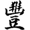
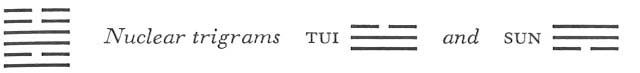

# Commentary: 55. Fêng / Abundance [Fullness]

[55. Fêng / Abundance Fullness](#pup-iching003.html_pup-iching003htmlpt05toc)

The ruler of the hexagram is the six in the fifth place. When it is said in the Judgment, “The king attains abundance. Be not sad. Be like the sun at midday,” the reference is to this line, for this is the king’s place. The line is yielding and in the center—the character of the sun at midday.

The Sequence

That which attains a place in which it is at home is sure to become great. Hence there follows the hexagram of ABUNDANCE. Abundance means greatness.

Miscellaneous Notes

ABUNDANCE means many occasions.
This hexagram is composed of Chên, which strives upward, and Li, which also moves upward. The nuclear trigrams are Tui, the Joyous, the lake, and Sun, the Penetrating, the wind. Hence wind and water, and thunder and lightning, are together here and all this points to great power. Something of a climax is indicated in that Chên, which is the more vigorous in movement, is above. While Shih Ho, BITING THROUGH (21) deals with the problem of surmounting a hindrance, here the hindrance is already surmounted. Still, greatness at a pinnacle suggests the danger of regression. The light is darkened in varying degree by the nuclear trigram Sun, wood, contained within the hexagram. The hexagram is one of those referringto the mutability of all earthly things. This is most likely also the meaning of the saying, “ABUNDANCE means many occasions,” that is, occasions for care and sorrow.

### THE JUDGMENT

> ABUNDANCE has success.
>
> The king attains abundance.
>
> Be not sad.
>
> Be like the sun at midday.

Commentary on the Decision

ABUNDANCE means greatness. Clarity in movement, hence abundance.

“The king attains abundance.” In this way greatness is emphasized.

“Be not sad. Be like the sun at midday.” One should give light to the whole world.

When the sun stands at midday, it begins to set; when the moon is full, it begins to wane. The fullness and emptiness of heaven and earth wane and wax in the course of time. How much truer is this of men, or of spirits and gods!

Fêng represents a time when clarity and progress bring about greatness and prosperity in public life. To achieve these, there is needed a strong and leading personality, drawing to itself others of like nature. Therefore it is not the relation of correspondence but that of congruity between the lines which must be taken into account (cf. the nine at the beginning and the nine in the fourth place, as well as the six in the second place and the six in the fifth place). But such a time of very great culture also carries hidden dangers. For according to the universal law of events, every increase is followed by decrease, and all fullness is followed by emptiness. There is only one means of making foundations firm in times of greatness, namely, spiritual expansion. Every sort of limitation brings a bitter retribution in its train. Abundance can endure only if everlarger groups are brought to share in it, for only then can the movement continue without turning into its opposite.

### THE IMAGE

> Both thunder and lightning come:
>
> The image of ABUNDANCE.
>
> Thus the superior man decides lawsuits
>
> And carries out punishments.

The Image is immediately intelligible, especially in association with the hexagram of BITING THROUGH (21). The trigrams Li, clarity, and Chên, shock, terror, give the prerequisites for a clearing of the atmosphere by the thunderstorm of a criminal trial.

### THE LINES

Nine at the beginning:

*a*) When a man meets his destined ruler,

They can be together ten days,

And it is not a mistake.

Going meets with recognition.

*b*) “They can be together ten days, and it is not a mistake.” More than ten days is harmful.
The line is strong and clear. The destined ruler that it meets, and that is of like kind, is the nine in the fourth place. The Chinese word *hsün* means a space of ten days, a complete cycle. Despite the situation in ABUNDANCE, one may spend a full cycle of time with a friend of kindred spirit without fear of making a mistake. One may therefore go unhesitatingly and seek him out, if he is in a high position. Nonetheless, the commentary warns against overstepping this time limit and against clinging to him after completion of the task. This is harmful. One must be able to stop at the right moment especially in times of abundance.

The Sung interpreters take the word *hsün* in the sense of “similar,” so that it would be an additional emphasizing of *p*’*ei*—“of like kind, destined for someone.”

Six in the second place:

*a*) The curtain is of such fullness

That the polestars can be seen at noon.

Through going one meets with mistrust and hate.

If one rouses him through truth,

Good fortune comes.

*b*) “If one rouses him through truth”—that is, one must rouse his will through trustworthiness.
The nuclear trigram Sun, wood, darkens the lines it covers, but the darkening here and as regards the nine in the fourth place is less marked than in the case of the nine in the third place, the center, where it is particularly strong. Because this second line is weak, it meets only with doubt and hatred when it turns toward the prince who belongs to it, the six in the fifth place, which is also weak. But since it is central and correct, the power of inner truth will enable it to overcome the separation and to arouse the will of the ruler.

Nine in the third place:

*a*) The underbrush is of such abundance

That the small stars can be seen at noon.

He breaks his right arm. No blame.

*b*) “The underbrush is of such abundance” that one can carry out no great transactions.

“He breaks his right arm”: in the end, one must not try to do anything.
Here the darkening is at its height. The nuclear trigram Sun is joined with the nuclear trigram Tui, lake, which limits the inherent possibility of accomplishing great things. Tui means to break. The right arm is denoted by the weak six at the top, which, in accordance with the relations in this hexagram, is not to be taken into account as an aid to the strong nine in the third place. If one refrains from action, recognizing that it is impossible, one remains blameless.

The word *p*’*ei*, rendered as “underbrush,” means also abody of water, and the word *mo*, rendered as “small stars,” means also foam, drizzle. However, the interpretation given above seems to suit the context better.

Nine in the fourth place:

*a*) The curtain is of such fullness

That the polestars can be seen at noon.

He meets his ruler, who is of like kind.

Good fortune.

*b*) “The curtain is of such fullness”: the place is not the appropriate one.

“The polestars can be seen at noon.” He is dark and not light-giving.

“He meets his ruler, who is of like kind. Good fortune.” This means action.
The first sentence here is the same as in the case of the six in the second place; the latter is the beginning and the present line the ending of the nuclear trigram Sun, wood. The place is not appropriate, because this is a hard line in a yielding place. The line is no longer in the trigram Li, hence no longer light-giving by nature. Light is below. However, movement enables it to meet the first line, which is of like kind, i.e., likewise strong. Thus light comes through action (the first line is light, because it is in the trigram Li), and with it good fortune.

Six in the fifth place:

*a*) Lines are coming,

Blessing and fame draw near.

Good fortune.

*b*) The good fortune of the six in the fifth place comes from the fact that it bestows blessing.
This line is related to the six in the second place. In the latter case the expression is “going,” here it is “coming.” The lines are the light, clear force just approaching by reason of the trigram Li, light—whose central line is the six in the second place—and thus making possible blessing and fame.

Six at the top:

*a*) His house is in a state of abundance.

He screens off his family.

He peers through the gate

And no longer perceives anyone.

For three years he sees nothing.

Misfortune.

*b*) “His house is in a state of abundance.” He flutters about at the border of heaven.

“He peers through the gate and no longer perceives anyone.” He screens himself off.
The weak line at the high point of movement goes too far. Thus it seems to rise continually higher, but precisely through this it loses its hold increasingly and moves ever farther from the light—all the more so as it is itself darkening the nine in the third place. Hence the six at the top falls into a hopelessly isolated state, for which it has only itself to blame.
