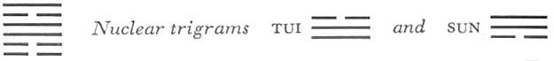

# Commentary: 56. Lü / The Wanderer

The ruler of the hexagram is the six in the fifth place. Therefore it is said in the Commentary on the Decision, “The yielding attains the middle outside,” and also, “Keeping still and adhering to clarity.” The fifth line is in the outer trigram; this symbolizes the wanderer in foreign parts. It is in the middle place as ruler of the trigram Li; this symbolizes attainment of the mean and adherence to clarity.

The Sequence

Whatever greatness may exhaust itself upon, this much is certain: it loses its home. Hence there follows the hexagram of THE WANDERER.

Miscellaneous Notes

He who has few friends: this is THE WANDERER.
This hexagram is so organized that the two primary trigrams tend to pull apart. Li, flame, goes upward, Kên, the mountain, presses downward; their union is only temporary. Kên (mountain) is a hostel, Li (fire) is the wanderer who does not tarry there long but must push on. This hexagram is the inverse of the preceding one.

### THE JUDGMENT

> THE WANDERER. Success through smallness.
>
> Perseverance brings good fortune
>
> To the wanderer.

Commentary on the Decision

“THE WANDERER. Success through smallness”: the yielding attains the middle outside and submits to the firm.

Keeping still and adhering to clarity; hence success in small things.

“Perseverance brings good fortune to the wanderer.” The meaning of the time of THE WANDERER is truly great.

The ruler of the hexagram is the six in the fifth place. It is yielding, hence it represents reserve and unpretentiousness. It is in the middle, hence it cannot be humiliated, though it is outside, in a strange land. It submits to the strong lines above and below, hence does not provoke misfortune. The lower trigram Kên indicates keeping still, inner reserve, while the upper trigram Li indicates clinging to outside things. A wanderer in a foreign country cannot easily find his proper place, hence it is a great thing to grasp the meaning of the time.

### THE IMAGE

> Fire on the mountain:
>
> The image of THE WANDERER.
>
> Thus the superior man
>
> Is clear-minded and cautious
>
> In imposing penalties,
>
> And protracts no lawsuits.

Usually, it is a question of criminal cases when clarity and movement come together (hexagrams 21, BITING THROUGH, and 55, ABUNDANCE). Here also we have clarity, in the upper trigram; the calm of the mountain signifies caution in imposing penalties. Dispatch in the settlement of criminal cases is moreover indicated in the mutual relationship of the trigrams. Fire does not linger on the mountain, but passes on rapidly.

### THE LINES

Six at the beginning:

*a*) If the wanderer busies himself with trivial things,

He draws down misfortune upon himself.

*b*) “If the wanderer busies himself with trivial things”: thereby his will is spent, and this is a misfortune.
This is a weak line at the very bottom of the trigram Kên, hence the suggestion of unworthy, trivial things. Kên denotes standing still. The line is far away from the trigram Li, clarity, hence it has no breadth of vision and consumes its will power on trivialities. For this reason its connection with the nine in the third place has not an enlightening but a harmful effect—just as throughout the hexagram, fire is regarded chiefly as a consuming, injurious force.

Six in the second place:

*a*) The wanderer comes to an inn.

He has his property with him.

He wins the steadfastness<a id="ref-1" href="#/com-56-l-the-wanderer?id=fn-1">1</a> of a young servant.

*b*) “He wins the steadfastness of a young servant.” This is not a mistake in the end.
This line is yielding and central, in the middle of the trigram Kên, which means door and hut; hence the image of an inn. The nuclear trigram Sun means market and gain; hence, “He has his property with him.” The young servant is the six at the beginning.

Nine in the third place:

*a*) The wanderer’s inn burns down.

He loses the steadfastness of his young servant.

Danger.

*b*) “The wanderer’s inn burns down.” This is a loss for him personally.

If he deals like a stranger with his subordinate, it is only right that he should lose him.
The line is too hard, since it is hard in a strong place. Hence it does not show devotion to its superior, therefore the latter does not help it, and its dwelling burns down. Owing to its hardness, it is unfriendly toward its subordinates and so loses their loyal affection, which naturally means danger. The line is at the top of the trigram Kên, meaning hut, and Li, fire, is immediately above it, hence the idea of the hut burning down. The servant is the six at the beginning.

Nine in the fourth place:

*a*) The wanderer rests in a shelter.

He obtains his property and an ax.

My heart is not glad.

*b*) “The wanderer rests in a shelter.” He has not yet obtained his place.

“He obtains his property and an ax.” But he is not yet glad at heart.
The shelter is only temporary, because the line is outside the trigram Kên. It rests only briefly, because it has not yet reachedits true place (the line is strong, the place is weak). Although it has property, it also needs an ax for defense (Li means weapons, and the nuclear trigram Tui means both metal and injury). Hence it is not yet glad at heart.

Six in the fifth place:

*a*) He shoots a pheasant.

It drops with the first arrow.

In the end this brings both praise and office.

*b*) In the end he rises through praise and office.
This line, which is yielding, and in the central place outside,<a id="ref-2" href="#/com-56-l-the-wanderer?id=fn-2">2</a> is the wanderer. Being central and devoted, it succeeds in gaining friends below (the nine in the fourth place) and an official position above (nine at the top); thus it rises.

The trigram Li denotes pheasant and weapons. The nuclear trigram Tui is metal, hence the idea of shooting. Tui is also the mouth, hence praise.

Chu Hsi interprets the second sentence as follows: “An arrow is lost.” Grammatically this version is of course also possible.

Nine at the top:

*a*) The bird’s nest burns up.

The wanderer laughs at first,

Then must needs lament and weep.

Through carelessness he loses his cow.

Misfortune.

*b*) Being at the top as a wanderer rightly leads to being burnt up.

“Through carelessness he loses his cow.” In the end he hears nothing.
The strong line at the top, whose movement moreover tends upward, loses its foundations. Thus all gaiety leads only to losses, because the line neglects all too much the duties of a wanderer, and even injury does not make it the wiser.

Li is bird and also flame. The place is high up, over the nuclear trigram Sun, hence the image of a nest. The idea of laughing derives from the nuclear trigram Tui, meaning gaiety and mouth. The idea of lamenting derives from the destructive force lurking in Tui. Li is cow; it is lost because of gaiety and carelessness in a high place. There is no hope for this line; it never comes to its senses, because it merely goes on striving further upward, giving no thought at all to return.

---

**Notes:**

<a id="fn-1" href="#/com-56-l-the-wanderer?id=ref-1">**1.**</a> Literally, “perseverance.”

<a id="fn-2" href="#/com-56-l-the-wanderer?id=ref-2">**2.**</a> In the outer trigram Li.
