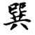
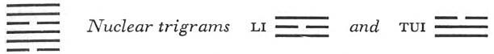

# Commentary: 57. Sun / The Gentle (Penetrating, Wind)

Although this hexagram is conditioned by the two yin lines, there is only one feminine hexagram, namely Li, THE CLINGING, in which the yin lines are the rulers. They are rulers because they occupy middle places. The two yin lines here are the constituting rulers of the hexagram but cannot be regarded as the governing rulers. The governing ruler is rather the nine in the fifth place, for only one who is in an honored place can “spread his commands abroad and carry out his undertakings.” When therefore it is said in the Commentary on the Decision, “The firm penetrates to the middle and to the correct, and its will is done,” the reference is to the fifth line.

The Sequence

The wanderer has nothing that might receive him; hence there follows the hexagram of THE GENTLE, THE PENETRATING. The Gentle means going into.

This means that the wanderer in his forlornness has no place to stay in, and that hence there follows Sun, the hexagram of homecoming.

Miscellaneous Notes

THE GENTLE means crouching.
The dark line is below, it crouches down beneath the light lines, and through this gentle crouching succeeds in penetrating among the strong lines.

Appended Judgments

THE GENTLE shows the exercise of character. Through THE GENTLE one is able to weigh things and remain hidden. Through THE GENTLE one is able to take special circumstances into account.

Gentle penetration makes the character capable of influencing the outside world and gaining control over it. For thus one can understand things in their inner nature without having to step into the forefront oneself. Herein lies the power of influence. In this position, one is able to make the exceptions demanded by the time, without being inconsistent.

Among the eight trigrams, Sun occupies the southeast, between spring and summer. It means the flowing of beings into their forms, it means baptism and giving life.

### THE JUDGMENT

> THE GENTLE. Success through what is small.
>
> It furthers one to have somewhere to go.
>
> It furthers one to see the great man.

Commentary on the Decision

Penetration repeated, in order to spread commands abroad.

The firm penetrates to the middle and to the correct, and its will is done.

Both of the yielding lines submit to the strong; therefore it is said: “Success through what is small. It furthers one to have somewhere to go. It furthers one to see the great man.”

This hexagram is constituted by a doubling of the trigram Sun, which means on the one hand gentleness, adaptability, on the other penetration. In the issuing of commands, it is all-important that they really penetrate the consciousness of the subordinates. This is effected by adaptation of the commands to their understanding. A twofold penetration is required: first penetration of a command to the feeling of the vassals, scattering the evil hidden in secret recesses, as the wind scatters clouds; second, a still deeper penetration, to the depths of consciousness, where the hidden good must be awakened. To obtain this effect, commands must be given repetitively.<a id="ref-1" href="#/com-57-sun-the-gentle-penetrating-wind?id=fn-1">1</a>

The text is further explained in the light of the structure of the hexagram. The strong line that has penetrated to the center—the correct place for it—is the nine in the fifth place; therefore its will is done, and it is favorable to undertake something. The yielding lines in the first and the fourth place obey the firm ruler of the hexagram above them. Hence success is connected with the small, which is furthered by seeing the great man (the nine in the fifth place).

### THE IMAGE

> Winds following one upon the other:
>
> The image of THE GENTLY PENETRATING.
>
> Thus the superior man
>
> Spreads his commands abroad
>
> And carries out his undertakings.

Of the two winds the first disperses resistances, “spreads his commands abroad,” and the second accomplishes the work, “carries out his undertakings.”

### THE LINES

Six at the beginning:

*a*) In advancing and in retreating,

The perseverance of a warrior furthers.

*b*) “In advancing and in retreating”: the will wavers.

“The perseverance of a warrior furthers.” The will is controlled.
This line is yielding and at the very bottom of the hexagram of THE GENTLE, hence the indecision. But in subordinating itself to the strong line over it, it is sustained by military discipline.

Nine in the second place:

*a*) Penetration under the bed.

Priests and magicians are used in great number.

Good fortune. No blame.

*b*) The good fortune of the great number is due to the fact that one has attained the middle.
The line is strong but central, hence indicates good fortune. The trigram Sun means wood, and the divided line below stands for legs; hence the image of a bed. The nuclear trigram Tui means mouth and magician. By submitting to the strong ruler of the hexagram, who is of like kind, the line is able to aid the ruler in spreading his commands, because it penetrates to the most secret corners. Priests are the intermediaries between men and gods; magicians serve as the intermediaries between gods and men. Here we have penetration of the realms of the visible and the invisible, whereby it becomes possible for everything to be set right.

Nine in the third place:

*a*) Repeated penetration. Humiliation.

*b*) The humiliation of repeated penetration comes from the fact that the will exhausts itself.
The third place is intermediate in the relation of the two Sun trigrams: one trigram is at its close, the other just beginning; hence penetration repeated. The nine in the third place is too hard and not central. Although this character is not suitable for gentle penetration to the core of things, it is attempted nonetheless. No result is achieved. Everything remains in a state of irresolute vacillation.

Six in the fourth place:

*a*) Remorse vanishes.

During the hunt

Three kinds of game are caught.

*b*) “During the hunt three kinds of game are caught.” This is meritorious.
The nuclear trigram Li means weapons, hence the hunt. The six in the fourth place is correct, submits to the ruler, and brings the three lower lines to him. In this way it acquires merit, and averts the remorse that might be occasioned by too much weakness.

Nine in the fifth place:

*a*) Perseverance brings good fortune.

Remorse vanishes.

Nothing that does not further.

No beginning, but an end.

Before the change, three days.

After the change, three days.

Good fortune.

*b*) The good fortune of the nine in the fifth place inheres in the fact that the place is correct and central.
This line, the ruler of the hexagram, is central in the upper trigram; hence it is the source of that influencing through commands which is the characteristic action of the hexagram. In contrast to the situation in Ku, WORK ON WHAT HAS BEEN SPOILED (18), where it is question of compensating for what the father and mother have spoiled, it is work on public matters that is described here. Such work is characterized not so much by love that covers up defects as by impartial justice, as symbolized by the west (metal, autumn), with which the eighth cyclic sign, Kêng<a id="ref-2" href="#/com-57-sun-the-gentle-penetrating-wind?id=fn-2">2</a> (rendered as “change”), is associated.

In order to enforce commands, it is necessary first to abandon a wrong beginning, then to attain the good end; hence the saying: “No beginning, but an end.” This saying is elaborated in the words: “Before the sign Kêng, three days. After the sign Kêng, three days.” The problem turns therefore on a decisive elimination of something that has developed as a wrong beginning. Three “days” before Kêng the summer draws to a close; then comes its end. Three “days” after Kêng comes winter, the end of the year. Therefore, although one has not achieved a beginning, at least the end is attainable. (This situation differs from that in hexagram 18, Ku, which lies in the middle between end and beginning.)

Nine at the top:

*a*) Penetration under the bed.

He loses his property and his ax.

Perseverance brings misfortune.

*b*) “Penetration under the bed.” At the top, the end has come.

“He loses his property and his ax.” Is this right? It brings misfortune.
By penetration under the bed, the second line establishes connection between what is above and what is below, and so sets everything in order. Here, however, the penetration signifies merely dependence and instability. Thus the line loses what it possesses of firmness (the line, strong in itself, loses its strength because it is at the top of the hexagram of gentleness), together with its ax (the nuclear trigram Tui means metal), so that it is no longer capable of any decision. Persistence in this attitude is definitely harmful.

---

**Notes:**

<a id="fn-1" href="#/com-57-sun-the-gentle-penetrating-wind?id=ref-1">**1.**</a> Cf. the modern theories on the nature of suggestion.

<a id="fn-2" href="#/com-57-sun-the-gentle-penetrating-wind?id=ref-2">**2.**</a> For a discussion of the cyclic signs or time divisions, see here. There this sign is listed as the seventh, therefore “eighth” must be assumed to be a slip.
