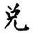
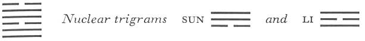

# Commentary: 58. Tui / The Joyous, Lake

The two yin lines are the constituting rulers of the hexagram but are incapable of acting as governing rulers. The second and the fifth line are the governing rulers. Therefore it is said in the Commentary on the Decision: “The firm is in the middle, the yielding is without. Joyousness and perseverance further.”

The Sequence

When one has penetrated something, one rejoices. Hence there follows the hexagram of THE JOYOUS. The Joyous means to rejoice.

Miscellaneous Notes

THE JOYOUS is manifest.
Tui is the lake, which rejoices and refreshes all living things. Furthermore, Tui is the mouth. When human beings give joy to one another through their feelings, it is manifested by the mouth. A yin line becomes manifest above two yang lines; this indicates how these two principles give joy to each other and how this becomes manifest outwardly. On the other hand Tui is linked with the west and with autumn. Its “stage of change”<a id="ref-1" href="#/com-58-tui-the-joyous-lake?id=fn-1">1</a> is metal. The cutting and destroying quality is the other side of its meaning. This hexagram is the inverse of the preceding one.

### THE JUDGMENT

> THE JOYOUS. Success.
>
> Perseverance is favorable.

Commentary on the Decision

THE JOYOUS means pleasure. The firm is in the middle, the yielding is without. To be joyous—and with this to have perseverance—furthers; thus does one submit to heaven and accord with men.

When one leads the way for the people joyously, they forget their drudgery; when one confronts difficulty joyously, the people forget death. The greatest thing in making the people joyous is that they keep one another in order.<a id="ref-2" href="#/com-58-tui-the-joyous-lake?id=fn-2">2</a>

The firm in the middle are the two lines in the second and the fifth place, while the yielding without are the six in the third place and the six at the top. That is the right kind of joy which is inwardly firm and outwardly gentle. This joy is also the best means of government.

### THE IMAGE

> Lakes resting one on the other:
>
> The image of THE JOYOUS.
>
> Thus the superior man joins with his friends
>
> For discussion and practice.

Tui means lake, also mouth. The repetition of mouth means general discussion, the repetition of lake means practice.

### THE LINES

Nine at the beginning:

*a*) Contented joyousness. Good fortune.

*b*) The good fortune of contented joyousness lies in the fact that one’s way has not yet become doubtful.
Firmness and modesty are the prerequisites of harmonious joy. Both are fulfilled in this strong line in a lowly place. When the light principle is bound to the shadowy, there are many doubts and scruples that interfere with joyousness. The line at the beginning is still far from all such complications, hence sure of good fortune.

Nine in the second place:

*a*) Sincere joyousness. Good fortune.

Remorse disappears.

*b*) The good fortune of sincere joyousness consists in having faith in one’s own will.
This line is in close relationship with the dark third line, hence doubt and remorse could set in. However, because it is central and firm, the sincerity of its nature and of its position prove stronger than the relationship. It trusts itself, is sincere toward others, and therefore meets with belief.

Six in the third place:

*a*) Coming joyousness. Misfortune.

*b*) The misfortune of coming joyousness lies in the fact that its place is not the proper one.
A weak line in a strong place, at the high point of joyousness—here control is lacking. When a man is open to distractions from without, they stream toward him and force their way in. Misfortune is certain, because he allows himself to be overwhelmed by the pleasures he has attracted.

Nine in the fourth place:

*a*) Joyousness that is weighed is not at peace.

After ridding himself of mistakes a man has joy.

*b*) The joy of the nine in the fourth place brings blessing.
This line holds the middle between the strong ruler, the nine in the fifth place, with which it has a relationship of receiving, and the yielding six in the third place, which is in the relationshipof holding together with it and is trying to seduce it. Although the person represented has still not altogether attained peace in this situation, he possesses enough inner strength both to decide whom he wishes to follow and to sever the relation with the six in the third place. From this, good fortune and blessing result both for him and for others.

Nine in the fifth place:

*a*) Sincerity toward disintegrating influences is dangerous.

*b*) “Sincerity toward disintegrating influences”: the place is correct and appropriate.
The disintegrating influences are represented by the six at the top. The nine in the fifth place, which is strong and correct, is inclined to place confidence in the line above. This is dangerous. However, the danger is avoidable, because by nature and position the present line is strong enough to overcome these influences.

Six at the top:

*a*) Seductive joyousness.

*b*) The reason why the six at the top seduces to pleasure is that it is not bright.
This line is similar to the six in the third place. But while the latter is in the inner trigram and draws pleasures to itself through its desire, the six at the top is in the outer trigram and tempts others to pleasure. “Seductive joyousness” does not pertain to the person consulting the oracle but shows a situation confronting him. It rests with him whether he will let himself be seduced. It is, however, important to be on one’s guard in face of such dubious situations.

There is a somewhat different interpretation for the “a” text, likewise based upon the Chinese literature on the *I Ching*.

---

**Notes:**

<a id="fn-1" href="#/com-58-tui-the-joyous-lake?id=ref-1">**1.**</a> See here.

<a id="fn-2" href="#/com-58-tui-the-joyous-lake?id=ref-2">**2.**</a> Another possible rendering here is “encourage one another.”
