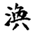
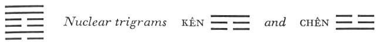

# Commentary: 59. Huan / Dispersion [Dissolution]

[59. Huan / Dispersion Dissolution](#pup-iching003.html_pup-iching003htmlpt05toc)

The ruler of the hexagram is the nine in the fifth place, because only a person occupying an honored place can bring order into world-wide dispersion. However, the nine in the second place is within, in order to strengthen the foundations, and the six in the fourth place is in the relationship of receiving to the nine in the fifth place, in order to complete the work of the latter. Consequently these two lines also have important functions within the hexagram. This is why it is said in the Commentary on the Decision: “The firm comes and does not exhaust itself. The yielding receives a place without, and the one above is in harmony with it.”

The Sequence

After joy comes dispersal. Hence there follows the hexagram of DISPERSION. Dispersion means scattering.

Miscellaneous Notes

DISPERSION means scattering.

Appended Judgments

They scooped out tree trunks for boats and they hardened wood in the fire to make oars. The advantage of boats and oars lay in providing means of communication. They probably took this from the hexagram of DISPERSION.

This hexagram has a double meaning. The first is suggested by the image of wind over water, indicating the breaking up of ice and rigidity. The second meaning is penetration; Sun penetrates into K’an, the Abysmal, indicating dispersion, division. As against this process of breaking up, the task of reuniting presents itself; this meaning also is contained in the hexagram.

The image of wood over water gives rise to the idea of a boat.

### THE JUDGMENT

> DISPERSION. Success.
>
> The king approaches his temple.
>
> It furthers one to cross the great water.
>
> Perseverance furthers.

Commentary on the Decision

“DISPERSION. Success.” The firm comes and does not exhaust itself. The yielding receives a place without, and the one above is in harmony with it.

“The king approaches his temple.” The king is in the middle.

“It furthers one to cross the great water.” To rely on wood is productive of merit.

“Comes” refers to position within the inner, i.e., lower trigram, while “goes” refers to position in the outer, i.e., upper trigram. The firm element that comes is therefore the nine in the second place. Occupying the middle place in the lower trigram, it creates for the light principle placed in the midst of dark lines a basis of activity as inexhaustible as water (K’AN). The yielding line that receives a place without and acts in harmony with the one above is the six in the fourth place, the minister. The action connoted by the hexagram is based upon the reciprocal relationships between the three lines in the fifth, the fourth, and the second place.

The king in the middle is the nine in the fifth place. His central position denotes the inner concentration that enables him to hold together the elements striving to break asunder.

The temple is suggested by the upper nuclear trigram Kên, mountain, house. The idea of crossing the great water derives from Sun (wood) and K’an (water).

### THE IMAGE

> The wind drives over the water:
>
> The image of DISPERSION.
>
> Thus the kings of old sacrificed to the Lord
>
> And built temples.

This again indicates an inward striving to hold together, through the fostering of religion, elements outwardly falling asunder. The task is to preserve the connection between God and man and between the ancestors and their posterity. Here likewise the image of the temple is suggested by the nuclear trigram Kên. Finally, the idea of entering is suggested by Sun, and the idea of the dark by K’an.

### THE LINES

Six at the beginning:

*a*) He brings help with the strength of a horse.

Good fortune.

*b*) The good fortune of the six at the beginning is based on its devotion.
The strong horse is the nine in the second place. K’an means a strong horse with a beautiful back. The six at the beginning is weak and in a lowly place, and does not itself possess the strength to stop the dissolution. But since the line is only at the beginning of the dissolution, its rescue is relatively easy. The strong, central nine in the second place comes to its aid, and the six submits and joins with it in service to the ruler in the fifth place.

Nine in the second place:

*a*) At the dissolution

He hurries to that which supports him.

Remorse disappears.

*b*) “At the dissolution, he hurries to that which supports him” and thus attains what he wishes.
The nuclear trigram Chên means foot and rapid running. The support upon which this line can count is that of the like-minded strong ruler, the nine in the fifth place. Because the man represented by the nine in the second place seeks out the prince on his own initiative, it might be surmised that he would have occasion to regret it. But he is strong and central, and his unusual behavior is caused by the unusual time. He does not act from egotistic motives, but wishes to put a stop to the dissolution, and this he finally achieves in fellowship with the nine in the fifth place.

Six in the third place:

*a*) He dissolves his self. No remorse.

*b*) “He dissolves his self.” His will is directed outward.
This is a weak line in a strong place, hence remorse could be expected. But it is the only line of the inner trigram that stands in the relationship of correspondence to a line of the outer trigram. Hence its will is directed outward. At the top of the trigram of water, it is in direct contact with the trigram of wind, hence the idea of dissolution in connection with one’s own self, and, consequently, the absence of remorse.

Six in the fourth place:

*a*) He dissolves his bond with his group.

Supreme good fortune.

Dispersion leads in turn to accumulation.

This is something that ordinary men do not think of.

*b*) “He dissolves his bond with his group. Supreme good fortune.” His light is great.
The lower trigram is to be regarded as a transformed K’un. K’un denotes a group of people. In that its middle line has detached itself and moved into the fourth place, it has dissolved its bond with its group and dissolved the group, for its place is now taken by the strong nine in the second place.

Thus through dispersion there comes accumulation (nuclear trigram Kên, mountain). This yielding line, the six in the fourth place, stands in the relationship of receiving to the ruler, the nine in the fifth place, and has won the strong official, the nine in the second place, as its assistant, so that accumulation does in fact follow upon dispersion.

Nine in the fifth place:

*a*) His loud cries are as dissolving as sweat.

Dissolution! A king abides without blame.

*b*) “A king abides without blame.” He is in his proper place.
Wind meeting water dissolves it as sweat is dissolved.<a id="ref-1" href="#/com-59-huan-dispersion-dissolution?id=fn-1">1</a> The trigram Sun, wind, which reaches everywhere, signifies loud cries. The king is in his proper place, hence without blame.

Nine at the top:

*a*) He dissolves his blood.

Departing, keeping at a distance, going out,

Is without blame.

*b*) “He dissolves his blood.” Thus he keeps at a distance from injury.
K’an is blood. Wind dissolves. Thus occasion for bloodshed is removed. Not only does the line itself surmount the peril, but it also helps the six in the third place, to which it is related.

---

**Notes:**

<a id="fn-1" href="#/com-59-huan-dispersion-dissolution?id=ref-1">**1.**</a> See the explanation of this line here.
