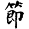
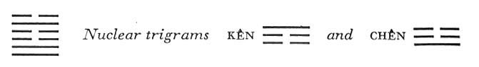

# Commentary: 60. Chieh / Limitation

The ruler of the hexagram is the nine in the fifth place. Only a man who is honored, and who possesses the necessary spiritual power for the task, can establish measure and mean for holding the world within bounds. Hence it is said in the Commentary on the Decision: “In the appropriate place, in order to limit; central and correct, in order to unite.”

The Sequence

Things cannot be forever separate. Hence there follows the hexagram of LIMITATION.

Miscellaneous Notes

LIMITATION means stopping.
This hexagram is the inverse of the preceding one, but the inner structure and the interrelationships of the nuclear trigrams are the same in both. Here water is held together by the lake, while in the preceding hexagram water is dispersed by the wind.

### THE JUDGMENT

> LIMITATION. Success.
>
> Galling limitation must not be persevered in.

Commentary on the Decision

“LIMITATION. Success.” The firm and the yielding are equally divided, and the firm have attained the middle places.

“Galling limitation must not be persevered in,” because its way comes to an end.

Joyous in passing through danger; in the appropriate place, in order to limit; central and correct, in order to unite.

Heaven and earth have their limitations, and the four seasons of the year arise.

Where limitation is applied in the creation of institutions, property is not encroached upon, and people are not harmed.

There are three yang lines and three yin lines symmetrically distributed—first two yang lines, then two yin lines, then one of each. Hence there are strong lines in the two central places, the second and the fifth.

To persist in galling limitation would lead to failure. But owing to the central and moderate behavior of the ruler of the” hexagram, the nine in the fifth place, this danger is overcome. Joyousness is the attribute of the lower trigram Tui, and danger that of the upper trigram K’an. The limitation of the ruler of the hexagram is brought about by the two yin lines between which it stands. But owing to its central and correct position, it attains an all-pervading influence.

Limitation—division into periods—is the means of dividing time. Thus in China the year is divided into twenty-four *chieh ch’i*, which, being in harmony with atmospheric phenomena, make it possible for man to arrange his agricultural activities so that they harmonize with the course of the seasons. The limitation or suitable division of production and consumption was one of the most important problems of good government in ancient China. Fundamental principles pertaining to this problem are also indicated in the present hexagram.

### THE IMAGE

> Water over lake: the image of LIMITATION.
>
> Thus the superior man
>
> Creates number and measure,
>
> And examines the nature of virtue and correct conduct.

The idea of number and measure is indicated by the reciprocal relationship between water and lake. Creating corresponds with the trigram K’an, and examining, literally “discussing,” corresponds with the trigram Tui, mouth. The idea of number and measure—the resting, firm—corresponds with the upper nuclear trigram Kên. The idea of virtue and conduct—the mobile, active—corresponds with the lower nuclear trigram Chên.

### THE LINES

Nine at the beginning:

*a*) Not going out of the door and the courtyard

Is without blame.

*b*) “Not going out of the door and the courtyard” is a sign that one knows what is open and what is closed.
This line stands at the very beginning. Kên, the nuclear trigram above, means gate, and we are still far away from it; we are not yet concerned with the outer double gate, but only with the inner single door. We see locked doors ahead and therefore hold back. Not going out of the door and the courtyard indicates discretion, essential in beginning any work that is to succeed.

Nine in the second place:

*a*) Not going out of the gate and the courtyard

Brings misfortune.

*b*) “Not going out of the gate and the courtyard brings misfortune,” because one misses the crucial moment.
Here the situation is different. Before us are two divided lines imaging an open double courtyard gate. It is now high time to go forth and not to hold back selfishly with the hoarded provisions (the nuclear trigram Chên, which begins with this line, indicates movement, therefore hesitation brings misfortune).

Six in the third place:

*a*) He who knows no limitation

Will have cause to lament.

No blame.

*b*) Lament over neglect of limitation—who is to blame for this?
The six in the third place is weak and stands at the top of the trigram Tui, joyousness; it therefore neglects necessary limitation. The trigram Tui means mouth, the nuclear trigram Chên means fear, and K’an means mourning, hence the idea of lament. But one has oneself to blame for this result.

Six in the fourth place:

*a*) Contented limitation. Success.

*b*) The success of contented limitation comes from accepting the way of the one above.
This correct, yielding line is in the relationship of receiving to the ruler. It adapts itself contentedly to its position, hence gains success by joining with the line above, the nine in the fifth place, which it follows.

Nine in the fifth place:

*a*) Sweet limitation brings good fortune.

Going brings esteem.

*b*) The good fortune of sweet limitation comes from remaining central in one’s own place.
The central, strong, and correct attitude of the ruler of the hexagram makes even holding back easy for it (it is at the top of the nuclear trigram Kên), and by its example it makeslimitation sweet for the others. The mountain, Kên, is composed chiefly of earth, the taste of which is sweet.

Six at the top:

*a*) Galling limitation.

Perseverance brings misfortune.

Remorse disappears.

*b*) “Galling limitation. Perseverance brings misfortune.” Its way comes to an end.
Here at the end of the time of LIMITATION one should not attempt forcibly to continue limitation. This line is weak and at the top of the trigram K’an, danger. Anything attempted here by force has a galling effect and cannot be continued. Hence a new direction must be taken, and thereupon remorse will disappear.
