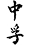
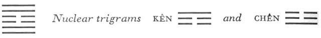

# Commentary: 61. Chung Fu / Inner Truth

The center of this hexagram is empty: this is its determining feature. Therefore the six in the third place and the six in the fourth place are the constituting rulers of the hexagram. However, truth depends in another aspect on the fact that the center has substance; therefore the nine in the second place and the nine in the fifth place are the governing rulers. Since, furthermore, the basic idea is that a whole realm is transformed by the strength of inner truth, the place of honor is necessary for this undertaking. Hence the actual ruler of the hexagram is the nine in the fifth place.

The Sequence

Through being limited, things are made dependable. Hence there follows the hexagram of INNER TRUTH.

Miscellaneous Notes

INNER TRUTH means dependability.
This hexagram, like the two that precede it, has a closed-off inner structure; it differs from them in the fact that its two outermost lines are strong. The eldest and the youngest daughter are together here in their appropriate positions, hence mutual trust is not disturbed. The attributes of the trigrams are well harmonized: gentleness is above, joyousness below, and the nuclear trigrams are rest and movement. Moreover, the entire structure of the hexagram is very harmonious and symmetrical: the yielding lines are within and the firm without. These are all highly favorable circumstances; therefore a highly favorable judgment goes with the hexagram.

### THE JUDGMENT

> INNER TRUTH. Pigs and fishes.
>
> Good fortune.
>
> It furthers one to cross the great water.
>
> Perseverance furthers.

Commentary on the Decision

INNER TRUTH. The yielding are within, yet the strong hold the middle. Joyous and gentle: thereby truly the country is transformed.

“Pigs and fishes. Good fortune.” The power of trust extends even to pigs and fishes.

“It furthers one to cross the great water.” One makes use of the hollow of a wooden boat. Inner truth, and perseverance to further one: thus man is in accord with heaven.

The yielding within are the third and the fourth line. The strong in the middle in the two trigrams are the second and the fifth line. The yielding lines in the middle of the hexagram create an empty space. This emptiness of heart, this humility, is necessary to attract what is good. However, central firmness and strength are needed to assure the essential trustworthiness. Thus the foundation on which the hexagram is built is an intermingling of yieldingness and strength.

Joyousness and gentleness are the attributes of the two primary trigrams: Tui means joyousness in following the good, and Sun means penetration into the hearts of men. Thus one establishes the foundation of trust that is necessary in transforming a country.

Pigs and fishes are the least intelligent of all creatures. When even such creatures are influenced, it shows the great power of truth.<a id="ref-1" href="#/com-61-chung-fu-inner-truth?id=fn-1">1</a> Wood and water, wood and a hollowed cavity, are interpreted as the image of a boat with which the great stream can be crossed.

### THE IMAGE

> Wind over lake: the image of INNER TRUTH.
>
> Thus the superior man discusses criminal cases
>
> In order to delay executions.

Tui is the image of the mouth—hence discussion. Sun is the Gentle, the hesitating—hence delay of executions. In other hexagrams, Sun also means commands. Killing and judging are attributes of Tui.<a id="ref-2" href="#/com-61-chung-fu-inner-truth?id=fn-2">2</a>

### THE LINES

Nine at the beginning:

*a*) Being prepared brings good fortune.

If there are secret designs, it is disquieting.

*b*) The preparedness of the nine at the beginning brings good fortune: the will has not yet changed.
The character translated as “prepared” originally meant the sacrifice offered on the day after a funeral, and from this it acquires the meaning of preparation. The character *yen*, “quiet” (in “disquieting”), really means the swallow, but from ancient times on it has also been used in combinations in the sense of *an*, “quiet.” This line is strong and dependable, inwardly serene and prepared. Its will is not influenced from without. Secret designs are suggested by its relationship of correspondence to the six in the fourth place. But in the hexagram of INNER TRUTH no secret exclusive relationships should occur.

Nine in the second place:

*a*) A crane calling in the shade.

Its young answers it.

I have a good goblet.

I will share it with you.

*b*) “Its young answers it”: this is the affection of the inmost heart.
The crane is a lake bird whose cry is heard in the autumn. Tui means lake and autumn. The nuclear trigram Chên denotes inclination to call, hence the image of a calling crane. It is under the nuclear trigram Kên, mountain, in the shadow of two yin lines, in the middle of Tui, the lake, hence “in the shade.” Its son is the nine at the beginning, which is of like kind and belongs to the same body (the lower trigram). According to another interpretation, its relationship is with the nine in the fifth place. This suggestion—of influence at a distance—gains added weight from the explanation given byConfucius (cf. here–here). Goblet and drinking are derived from Tui, mouth.

Six in the third place:

*a*) He finds a comrade.

Now he beats the drum, now he stops.

Now he sobs, now he sings.

*b*) “Now he beats the drum, now he stops.” The place is not appropriate.
A yielding line in a firm place at the high point of joyousness suggests a lack of self-control. The line is attracted by the nine at the top but finds no footing there, because attractions are contrary to the spirit of the hexagram. It also fails to attach itself to the neighboring six in the fourth place (no doubt the comrade referred to), which is of like kind.

Drumming in ancient China was the signal for advance; a retreat, or cessation of an attack, was indicated by the striking of a metal gong. This line stands in the two nuclear trigrams Chên (the Arousing) and Kên (Keeping Still). The alternation of sobbing and laughing is derived from the primary trigram Tui and the nuclear trigram Chên.

Six in the fourth place:

*a*) The moon nearly at the full.

The team horse goes astray.

No blame.

*b*) “The team horse goes astray.” It separates from its kind and turns upward.
The team horse is the six in the third place. But the fact that there is similarity in kind has no determining effect. The line is correct in its place and has a receiving relationship to the ruler of the hexagram, the nine in the fifth place, whom it serves as minister. Hence the turning away from its mate of like kind toward what is above.

Nine in the fifth place:

*a*) He possesses truth, which links together.

No blame.

*b*) “He possesses truth, which links together.” The place is correct and appropriate.
The image of linking together derives from the meaning of the upper trigram Sun, rope, and that of the upper nuclear trigram Kên, hand. For the rest, the influence of this line as ruler of the hexagram is shown by the correct, central, and honored position it occupies.

Nine at the top:

*a*) Cockcrow penetrating to heaven.

Perseverance brings misfortune.

*b*) “Cockcrow penetrating to heaven.” How could such a one last long?
The cock is associated with the trigram Sun. It wants to fly to heaven, but that it cannot do. Hence only the cry issues forth (Sun means a shouting that penetrates everywhere, like the wind). This means an exaggeration: the expression is stronger than the feeling. It creates false pathos, because it is not to be reconciled with inner truth. In the long run misfortune results. The line is too strong in its exposed position and is therefore no longer carried by the strength of the hexagram, hence this misfortune.

---

**Notes:**

<a id="fn-1" href="#/com-61-chung-fu-inner-truth?id=ref-1">**1.**</a> The *Chou I Hêng Chieh* see here, n. 4 gives another interpretation. There the two words are read together as meaning pig-fishes, i.e., dolphins: “Dolphins originate in the ocean (Tui) and warn boats (Sun) when a wind is coming up. They are reliable harbingers of storm, hence the symbol of inner truth. The approaching wind is heralded by definite signs, causing the dolphins to rise to the surface. Thus inner truth is the means of understanding the future.”\ The idea is very ingenious, except for the fact that the Book of Changes goes back to a time when the ocean was still unknown to the Chinese.

<a id="fn-2" href="#/com-61-chung-fu-inner-truth?id=ref-2">**2.**</a> As the symbol of the west and of autumn, the place and time of death.
