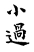
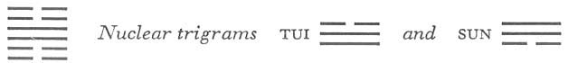

# Commentary: 62. Hsiao Kuo / Preponderance of the Small

The rulers of the hexagram are the second and the fifth line, because they are yielding and hold the middle. They are in a time when a transition must be made, but without going too far.

The Sequence

When one has the trust of creatures, one sets them in motion; hence there follows the hexagram of PREPONDERANCE OF THE SMALL.

Miscellaneous Notes

PREPONDERANCE OF THE SMALL signifies a transition.

Appended Judgments

The rulers split wood and made a pestle of it. They made a hollow in the ground for a mortar. The use of the mortar and pestle was of benefit to all mankind. They probably took this from the hexagram of PREPONDERANCE OF THE SMALL.

The Chinese word *kuo* cannot be translated in such a way as to render all its secondary meanings. It means to pass by, and then comes the idea of excessiveness, preponderance; in fact, it means everything that results from exceeding the mean. The hexagram deals with transitional states, extraordinary conditions. It is so constructed that the yielding elements are on the outside. When, given such a structure, strong lines predominate, the hexagram of PREPONDERANCE OF THE GREAT (28) results; but when the weak lines are in the majority, we have PREPONDERANCE OF THE SMALL. The nuclear trigrams of the present hexagram produce the same structure as the primary trigrams of hexagram 28. This hexagram is the opposite of the preceding one.

### THE JUDGMENT

> PREPONDERANCE OF THE SMALL. Success.
>
> Perseverance furthers.
>
> Small things may be done; great things should not be done.
>
> The flying bird brings the message:
>
> It is not well to strive upward,
>
> It is well to remain below.
>
> Great good fortune.

Commentary on the Decision

PREPONDERANCE OF THE SMALL. The small preponderate and have success. To be furthered in transition by perseverance: this means going with the time.

The yielding attains the middle, hence good fortune in small things.

The hard has lost its place and is not in the middle: hence one should not do great things.

The hexagram has the form of a flying bird.

“The flying bird brings the message: It is not well to strive upward, it is well to remain below. Great good fortune.” Striving upward is rebellion, striving downward is devotion.

In exceptional times exceptional measures are necessary for reestablishing the norm. The point here is that the time demands a restraint that would appear to be excessive. It is a time like that of King Wên and the tyrant Chou Hsin, and this restraint, which might appear exaggerated, is exactly what the time calls for. Preponderance of the small is indicated by the fact that yielding, i.e., small lines hold the middle places and thus are rulers of the hexagram, while the strong lines have been forced out of key positions outside into places inside, without being central.

PREPONDERANCE OF THE GREAT is like a beam; its danger lies in excessive weight, therefore it must be supported in the middle from below. PREPONDERANCE OF THE SMALL is like a bird; the danger for it lies in mounting too high and losing the ground under its feet.

### THE IMAGE

> Thunder on the mountain:
>
> The image of PREPONDERANCE OF THE SMALL.
>
> Thus in his conduct the superior man gives preponderance to reverence.
>
> In bereavement he gives preponderance to grief.
>
> In his expenditures he gives preponderance to thrift.

Thunder rising from the plain to the heights becomes gradually fainter in transition. From this is taken the idea of overweighting, of doing a little too much in the right way. For it is precisely by doing a little too much in the direction of the small that we hit the mark as to what is right. It is thus that we attain the right degree of reverence in our conduct, the right degree of mourning at a burial, and the right degree of economy in expenditures. Conduct is suggested by the upper trigram Chên, movement, and burial by the position of the nuclear trigrams—Tui, the lake, over Sun, wood (cf. hexagram 28, in which the idea of burial is likewise represented by this combination). Thrift in spending is suggested by the trigram Kên, mountain, which indicates limitation.

### THE LINES

Six at the beginning:

*a*) The bird meets with misfortune through flying.

*b*) “The bird meets with misfortune through flying.” Here there is nothing to be done.
This line is in the lowest place in the trigram Kên, mountain. It ought to keep still, but since according to the meaning of the hexagram, the weak preponderates, and since there is a secret relationship between it and the nine in the fourth place, it will not suffer restraint, but seeks to soar like a flying bird. But in doing so it willfully endangers itself; for if a bird flies up when it is time for it to keep still, it is sure to fall into the hands of the hunter.

Six in the second place:

*a*) She passes by her ancestor

And meets her ancestress.

He does not reach his prince

And meets the official.

No blame.

*b*) “He does not reach his prince.” The official should not wish to surpass (the prince).
The nine in the third place is the father, the nine in the fourth place the grandfather, the six in the fifth place the grandmother. Congruity relates the present line to the six in the fifth place. But because it is presupposed in this hexagram that the small passes by and surmounts the great, and because furthermore the six in the fifth place is the ruler of the hexagram, the image of the ancestress is chosen. In another aspect, the present line represents an official who does not surpass the yielding prince, the six in the fifth place, because he himself is yielding in nature. In the nine in the third place he meets with an official with whom he is united through the relationship of holding together.

Nine in the third place:

*a*) If one is not extremely careful,

Somebody may come up from behind and strike him.

Misfortune.

*b*) “Somebody may come up from behind and strike him.” What a misfortune this is!
This line is strong, it is true, but the six in the second place is in a more favorable position, because it is not only central but also a ruler of the hexagram. The nine in the third place, being at the top of the primary trigram Kên, can guard itself against unexpected accidents. If it fails to do this, disaster comes from behind.

Nine in the fourth place:

*a*) No blame. He meets him without passing by.

Going brings danger. One must be on guard.

Do not act. Be constantly persevering.

*b*) “He meets him without passing by.” The place is not the appropriate one.

“Going brings danger. One must be on guard.” One must on no account continue thus.
The strength of the nine in the fourth place is modified by the weakness of the place. It is the place of the minister. He does not seek to surpass his prince but meets him, so that all is well. However, as ruler of the upper trigram Chên, the line is too readily inclined to be drawn into excessive movement, which would be dangerous. Hence the warning against action.

Six in the fifth place:

*a*) Dense clouds,

No rain from our western territory.

The prince shoots and hits him who is in the cave.

*b*) “Dense clouds, no rain”: he is already above.
The oracle, “Dense clouds, no rain,” appears also in THE TAMING POWER OF THE SMALL (9), which deals with a somewhat similar situation. There, however, it is the strong lines at the top that finally cause the clouds to condense to rain. Here, where the small passes by the great, the six in the fifth place is too high up. There is no strong line above it that could condense the clouds. The upper trigram Tui is the west. It also means metal, hence the image of shooting. The man in the cave is the six in the second place. The word for shooting means shooting with an arrow attached to a line for the purpose of dragging in the game that has been shot. The connection arises from the fact that the present line and the six in the second place are related through similarity of kind.

Six at the top:

*a*) He passes him by, not meeting him.

The flying bird leaves him.

Misfortune.

This means bad luck and injury.

*b*) “He passes him by, not meeting him.” He is already arrogant.
The six at the top really stands in the relationship of correspondence to the nine in the third place, but at a time when the small passes by the great, this relationship does not apply. The six at the top is directed upward only. Thus the image of the bird appears again. In the case of the six at the beginning, disaster results from impatience; here it comes from the fact that the line is too high, too arrogant, and unwilling to come back. As a result, it loses its way, leaves the others, and draws disaster upon itself from both gods and men.
