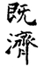
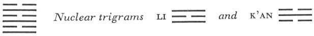

# Commentary: 63. Chi Chi / After Completion

The ruler of the hexagram is the six in the second place. The hexagram of AFTER COMPLETION means that at first good fortune prevails and in the end disorder. The six in the second place is in the inner trigram just at the time when good fortune begins. Therefore it is said in the Commentary on the Decision: “ ‘At the beginning good fortune’; the yielding has attained the middle.”

The Sequence

He who stands above things brings them to completion. Hence there follows the hexagram of AFTER COMPLETION.

Miscellaneous Notes

AFTER COMPLETION means making firm.
This hexagram is the only one in which all the lines stand in their proper places. It is the hexagram of transition from T’ai,PEACE (11) to P’i, STANDSTILL (12). It contains the two primary trigrams K’an, water, and Li, fire, which likewise, in the reverse order, constitute its nuclear trigrams. K’an strives downward and Li upward; hence the outer and the inner organization of the hexagram create a state of equilibrium that is obviously unstable.

### THE JUDGMENT

> AFTER COMPLETION. Success in small matters.
>
> Perseverance furthers.
>
> At the beginning good fortune,
>
> At the end disorder.

Commentary on the Decision

“AFTER COMPLETION. Success.” In small matters there is success.

“Perseverance furthers.” The firm and the yielding are correct, and their places are the appropriate ones.

“At the beginning good fortune”: the yielding has attained the middle.

If one stands still at the end, disorders arise, because the way comes to an end.

The ruler of the hexagram is the six in the second place; although weak, it has success because it stands in the relationship of correspondence to the strong nine in the fifth place. Perseverance furthers because all the lines are in their appropriate places, and therefore any deviation brings misfortune. At the beginning all goes well, because the yielding six in the second place occupies the middle in the trigram Li, clarity. It is a time of very great cultural development and refinement. But when no further progress is possible, disorder necessarily arises, because the way cannot go on.

### THE IMAGE

> Water over fire: the image of the condition
>
> In AFTER COMPLETION.
>
> Thus the superior man
>
> Takes thought of misfortune
>
> And arms himself against it in advance.

In one aspect, fire and water counteract each other, whereby an equilibrium is created; in another aspect, however, fear of a collapse is also suggested. If the water escapes, the fire goes out; if the fire flames high, the water dries up. Hence precautionary measures are necessary. The trigram K’an suggests danger and disaster, Li suggests clarity, foresight. The taking thought occurs in the heart, the arming in external actions. The danger still lurks unseen, hence only reflection enables one to perceive it in time and thus avert it.

### THE LINES

Nine at the beginning:

*a*) Nine at the beginning means:

He brakes his wheels.

He gets his tail in the water.

No blame.

*b*) “He brakes his wheels.” According to the meaning, there is no blame in this.
K’an denotes wheel, fox, hindering. The first line is at the rear of the fox, hence the tail. Because it has a connection with the lowest line of the upper primary trigram, K’an, it gets wet. Since the lower nuclear trigram is likewise K’an, the symbols of the fox and the wheel occur here at the very beginning. The possibility of overcoming the danger by holding back firmly arises from the strong nature of the line.

Six in the second place:

*a*) The woman loses the curtain of her carriage.

Do not run after it;

On the seventh day you will get it.

*b*) “On the seventh day you will get it,” as a result of the middle way.
The primary trigram Li, in which this is the middle line, is the middle daughter, hence a woman as the symbol. The sameidea is suggested by the fact that the line is yielding and in the relationship of correspondence to the husband, the nine in the fifth place. K’an means wagon, Li means curtain. K’an also means robbers, hence the theft of the curtain. “After seven days” means the complete cycle of change in the six lines of the hexagram; at the seventh change the starting point recurs. The line is yielding and stands between two strong lines; it can be compared to a woman who has lost her veil and is consequently exposed to attack. But since she is correct, these attacks do her no harm. She remains true to her husband and also obtains her veil again.

Nine in the third place:

*a*) The Illustrious Ancestor

Disciplines the Devil’s Country.

After three years he conquers it.

Inferior people must not be employed.

*b*) “After three years he conquers it.” This is exhausting.
Li means weapons. The Devil’s Country is the territory of the Huns in the north. North is the direction of K’an. This line is in the middle of the nuclear trigram K’an. It is a strong line in a strong place. “The Illustrious Ancestor” is the dynastic title of Wu Ting, the emperor who gave a new impetus to the Yin dynasty. The warning against employing inferior people is suggested by the secret relation of this line to the weak six at the top.

Six in the fourth place:

*a*) The finest clothes turn to rags.

Be careful all day long.

*b*) “Be careful all day long.” There is cause for doubt.
This is a yielding line in a yielding place at the beginning of danger. Hence the warning that even the finest clothes turn to rags. Cause for doubt comes from the trigram K’an, danger, which we enter here.

Chêng Tz
u gives another explanation. He employs theimage of a boat, and says: “It has a leak, but there are rags for plugging it up.”

Nine in the fifth place:

*a*) The neighbor in the east who slaughters an ox

Does not attain as much real happiness

As the neighbor in the west

With his small offering.

*b*) The eastern neighbor, who slaughters an ox, is not as much in harmony with the time as the western neighbor. The latter attains true happiness: good fortune comes in great measure.
Li is the ox. K’an represents the pig slaughtered in the small sacrifice. The second line, which is in the nuclear trigram K’an, is the western neighbor, because in the Sequence of Earlier Heaven, K’an is placed in the west. The fourth line, which is in the nuclear trigram Li, is the eastern neighbor, because Li stands opposite to K’an. The nine in the fifth place presides over the sacrifice. The six in the second place is central; it brings the intrinsically lesser offering of a pig at the right time and therefore has greater happiness than the six in the fourth place, which, though it brings the relatively greater offering of an ox, is not central.

Six at the top:

*a*) He gets his head in the water. Danger.

*b*) “He gets his head in the water.” How can one endure this for long?
While the nine at the beginning is the tail of the fox, the six at the top is its head. It gets into the water because it is a weak line at the top of K’an, water, danger. While crossing the water it turns back and so incurs the danger of drowning. These are the disorders prophesied by the hexagram as the final outcome.
