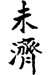
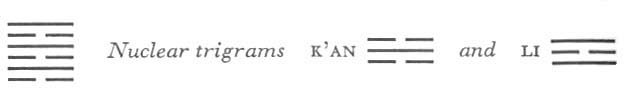

# Commentary: 64. Wei Chi / Before Completion

The ruler of the hexagram is the six in the fifth place, because BEFORE COMPLETION implies a time in which at first disorder prevails, then finally order. The six in the fifth place is in the outer trigram and initiates the time of order. Therefore it is said in the Commentary on the Decision: “ ‘BEFORE COMPLETION. Success.’ For the yielding attains the middle.”

The Sequence

Things cannot exhaust themselves. Hence there follows, at the end, the hexagram of BEFORE COMPLETION.

Miscellaneous Notes

BEFORE COMPLETION is the exhaustion of the masculine.
This hexagram is at once the inverse and the opposite of the preceding one. K’an and Li, both as nuclear and as primary trigrams, have changed places. The hexagram depicts the transition from P’i, STANDSTILL (12) to T’ai, PEACE (11). Outwardly viewed, none of the lines appears in its proper place; but they are all in relationship to one another, and order stands preformed within, despite the outward appearance of complete disorder. The strong middle line has come down from the fifth place to the second and has thus established a connection. Itis true that K’un is not yet above nor Ch’ien below, as in the hexagram T’ai, but their representatives, Li and K’an, are in these positions. Li and K’an represent K’un and Ch’ien in spirit and influence (because of their respective middle lines). In the phenomenal world (Sequence of Later Heaven) they are the representatives of K’un and Ch’ien, and stand in the regions of the latter—Li in the south and K’an in the north.

### THE JUDGMENT

> BEFORE COMPLETION. Success.
>
> But if the little fox, after nearly completing the crossing,
>
> Gets his tail in the water,
>
> There is nothing that would further.

Commentary on the Decision

“BEFORE COMPLETION. Success.” For the yielding attains the middle.

“The little fox has nearly completed the crossing”: he is not yet past the middle.

“He gets his tail in the water. There is nothing that would further.” Because the matter does not go on to the end.

Although the lines are not in their appropriate places, the firm and the yielding nevertheless correspond.

K’an has the fox as its symbol, and also denotes water. There is hope of success because the firm and the weak lines all correspond. The ruler of the hexagram, the six in the fifth place, has reached the middle, and this insures the right attitude for bringing about completion. The nine in the second place, on the other hand, has not yet passed the middle, and in its case this is dangerous. It is a strong line hemmed in between two yin lines. Like the incautious young fox that runs rashly over the ice, it relies too much on its strength. Therefore it gets its tail wet; the crossing does not succeed.

### THE IMAGE

> Fire over water:
>
> The image of the condition before transition.
>
> Thus the superior man is careful
>
> In the differentiation of things,
>
> So that each finds its place.

Fire flares upward, water flows downward; hence there is no completion. If one were to attempt to force completion, harm would result. Therefore one must separate things in order to unite them. One must put them into their places as carefully as one handles fire and water, so that they do not combat one another.

### THE LINES

Six at the beginning:

*a*) He gets his tail in the water.

Humiliating.

*b*) “He gets his tail in the water.” For he cannot take the end into view.
Here we have the same images as in the preceding hexagram, though somewhat differently distributed. The first line is the tail. It.is weak and stands at the bottom in a dangerous position, hence does not perceive the consequences of its actions. It rashly tries to cross and fails.

Nine in the second place:

*a*) He brakes his wheels.

Perseverance brings good fortune.

*b*) The nine in the second place has good fortune if it is persevering. It is central and hence acts correctly.
Here the image of the wheel and of braking, which in the preceding hexagram is associated with the first line in virtue of its strength, is transferred to the strong second line. The strength and correctness of the latter make the outlook favorable.

Six in the third place:

*a*) Before completion, attack brings misfortune.

It furthers one to cross the great water.

*b*) “Before completion, attack brings misfortune.” The place is not the appropriate one.
The place is at the end of the lower primary trigram K’an, danger, so that completion would be possible. But since the line is too weak for this decisive position, and since it stands at the beginning of the nuclear trigram K’an, a new danger arises. One should not attempt to force completion but should try to get clear of the whole situation. A change of character is necessary. Owing to the fact that the line changes from a six into a nine, the trigram Sun develops below; this, together with the primary trigram K’an, results in the image of a boat over water, hence the crossing of the great water.

Nine in the fourth place:

*a*) Perseverance brings good fortune.

Remorse disappears.

Shock, thus to discipline the Devil’s Country.

For three years, great realms are awarded.

*b*) “Perseverance brings good fortune. Remorse disappears.” What is willed is done.
As this hexagram is the inverse of the preceding one, the disciplining of the Devil’s Country, there mentioned in connection with the third place, appears here in connection with the fourth. Here the result is more favorable—there three years of fighting, here three years of rewards. The present line is a strong official who assists the gentle ruler in the fifth place and therefore carries out his will.

Six in the fifth place:

*a*) Perseverance brings good fortune.

No remorse.

The light of the superior man is true.

Good fortune.

*b*) “The light of the superior man is true.” His light brings good fortune.
This line is in the middle of the trigram Li, light, hence everything is favorable for accomplishing the transition to a new period.

Nine at the top:

*a*) There is drinking of wine

In genuine confidence. No blame.

But if one wets his head,

He loses it, in truth.

*b*) When one wets his head while drinking wine, it is because he knows no moderation.
The top line is strong and inherently favorable. The image of wine comes from the trigram K’an; the present line is in relationship with the top line of K’an. As in the preceding hexagram, the image of a head—wetting occurs. But here it is only a possibility, an avoidable danger.

Thus at its close the Book of Changes leaves the situation open for new beginnings and new formations. The same idea indeed finds expression in the *Tsa Kua*, Miscellaneous Notes on the Hexagrams, in which Kuai, BREAK-THROUGH (43), is placed at the end, with these closing words:

BREAK-THROUGH means resoluteness. The strong turns resolutely against the weak. The way of the superior man is in the ascendant, the way of the inferior man leads to grief.
